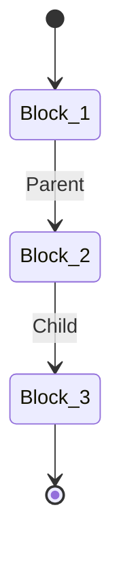
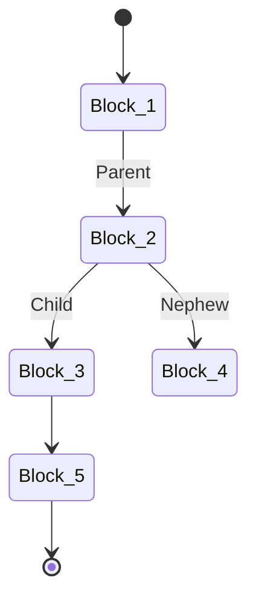

Blockchain technologies are trending. There’s a lot of information about what they do and how they work but often these are abstract high level overviews. Looking beneath the surface, these overviews skip some of the most fascinating parts of the implementations that bring these technologies to life.

## What is a Blockchain

IBM has one of my [favorite definitions](https://www.ibm.com/topics/what-is-blockchain):

> Blockchain is a shared, immutable ledger that facilitates the process of recording transactions and tracking assets \[... on] a network.
> An asset can be tangible (a house, car, cash, land) or intangible (intellectual property, patents, copyrights, branding). Virtually
> anything of value can be tracked \[... ] on a blockchain network, reducing risk \[...] for all involved.

There’s a few key items to highlight from this definition are:

- A shared, immutable ledger
- Recording and tracking assets

Simply put, a Blockchain is a list of changes to assets, called transactions, which are grouped in blocks that are recognized by all participants in the network.

Unfortunately, it leaves out one major element. How do blockchain networks reduce risk? How do blockchain networks agree on the shared ledger?

## Consensus

In the world of blockchain, consensus is the agreement of which block is next. Collectively all the participants in the blockchain’s network
should come to the same conclusion.

You’ve probably heard of “Proof of Work”, usually called mining, and “Proof of Stake”, these two are the most popular in terms of market share
in the crypto markets.

These consensus algorithms were some of the first to be popularized by projects like Bitcoin and Ethereum. These are far from the only ones, Proof of Authority, Proof of Burn, Proof of Capacity and Proof of History are just from others mentioned on [Investopedia's Website](https://www.investopedia.com/terms/c/consensus-mechanism-cryptocurrency.asp).

Let’s dive deeper into the two popular algorithms to see how they obtain consensus.

### Proof of Work

Proof of Work is based on a mathematical expression which is very costly to compute a magic number, called a nonce, but easily verified. Each participant, typically referred to as a miner, begins the calculation with the transitions it’s heard on the network since the last published block. Participants race each other to find the right answer and the winner traditionally gets a reward. It’s difficult to cheat and very rewarding to operate in good faith.

At the time of writing, January 28th 2022, the reward is 6.25 BTC which is worth 236,755 USD. It’s easy to draw parallels to the 1849 Gold Rush.

When miners hear of a new block, they immediately stop their calculation and begin listening for more transactions. This is approximately a 10 minute window for Bitcoin.

With a small number of competitors it’s pretty straightforward but when tens of thousands of nodes are involved, what happens if two miners finish at the same time. Who wins?

### Proof of Stake

Proof of Stake is an investment strategy where committing more capital means you’re more likely to get the reward. [Peercoin](https://www.peercoin.net/whitepapers/peercoin-paper.pdf), a very early PoS implementation, kept the mining of PoW but required less computational complexity the more _coinage_ was staked. If two participants offer the same investment in the next block, which one is rewarded?

If someone is able to offer more capital for their block to be accepted, are they able to always win? Yes, this is a special type of security exploit called a 51% attack. If the confirmation of the next block is tied to a resource, then an entity which holds a majority stake can take control of the blockchain. Proof of Work is also susceptible to this type of attack.

### Stale and Orphan Blocks

Most blockchain’s are actually trees, not linked lists which is what probably comes to mind for young data scientists. This probably comes as a shock but it’s the secret ingredient to solving our racing condition when two participants propose the next block in PoW.

> If two nodes broadcast different versions of the next block simultaneously, some
> nodes may receive one or the other first. In that case, they work on the first one they received,
> but save the other branch in case it becomes longer.
> The tie will be broken when the next proof-of-work is found and one branch becomes longer.

[_Bitcoin: A Peer-to-Peer Electronic Cash System Section 5_](https://bitcoin.org/bitcoin.pdf)

Chains are made of links that connect to others. This data structure is referred to as a linked list, when a link
points to both it’s parent and child is a doubly linked list. Three sequential blocks being published would make the following chain:

If block 4 was published at the same time as our block 3 a node would have the following tree:

Since it’s extremely unlikely that a second pair of blocks would also be published at the same time, the tie is broken when the next sequential block is published. This is block 5 in the diagram above.

#### Which branch should we follow

Well, intuitively the “strongest” branch of our tree is the one we should stick with. The strength comes from the amount of work that has gone into making the branch. More work means it’s less likely that someone has cheated or lied.

### Dynamic Validator Sets

[Ethereum’s new PoS system named _Consensus Layer_](https://ethereum.org/en/upgrades/merge), [formally Ethereum 2.0](https://blog.ethereum.org/2022/01/24/the-great-eth2-renaming/), is still in development but it’s leading implementation is [Casper FFG](https://arxiv.org/pdf/1710.09437.pdf) [\[2\]](https://eips.ethereum.org/EIPS/eip-1011) (there’s also [this](https://vitalik.ca/general/2018/12/05/cbc_casper.html) alternative) which uses a Byzantine Fault Tolerance consensus.

In Proof of Stake, the participants are called validators who’s role is similar to miners in Proof of Work. The validator is staking money on the block that it thinks should be added to the chain. If the block gets appended, then they get a reward that is proportional to the bet that they placed on the block. [\[1\]](https://www.chubbydeveloper.com/ethereum-proof-of-stake-casper-ffg-vs-casper-cbc/) Validators are responsible for following the forking rules when staking checkpoints. Validators decide which block is the best by following a set of rules.

<https://arxiv.org/pdf/1710.09437.pdf>

The proposal set the stake deposit at 32 ETH to be eligible to act as a validator. At the time of writing that has a value of 81,374.81 USD even after a recent drop in value.

There’s a few key concepts employed in Casper FFG, many are outlined in the [EIPS 1011’s Glossary](https://eips.ethereum.org/EIPS/eip-1011#glossary)

- Checkpoint is the block in the finalization stage
- Epoch is the range of blocks between checkpoints. This grow by one block for each new epoch
- Dynasty refers to the number of finalized checkpoints in the chain. (Note: checkpoints do not reach finality unless a super-majority of votes are obtained in favor)

The validators are _randomly_ selected (this is not detailed in the proposals but details are available [here](https://github.com/ethereum/casper/blob/4adeffce5709fcf2d36f4bc6ac27bbd62747d032/VALIDATOR_GUIDE.md)) based on who has deposited the correct funds. Participants must deposit the correct sum 2 dynasties in advance to join a validator set. In order to leave they must send a withdrawal request 2 dynasties in advance, however the funds are not returned for approximately 4 months since the withdrawal was requested.

Consensus, or finality, is not reached unless ⅔, a super-majority of votes have been gathered stating the checkpoint meets the forking rules “follow the chain containing the justified \[block] of the greatest height”.

When a checkpoint is finalized all the blocks in it’s epoch are implicitly finalized as well. This also marks the start of a new dynasty, casting the previous on to history it can no longer be modified and reaches immutability. This is also when validators can enter or exit the staking on checkpoints.

## References

<https://developer.bitcoin.org/devguide/p2p_network.html?highlight=stale%20orphan#orphan-blocks>

<https://developer.bitcoin.org/devguide/block_chain.html?highlight=stale#block-height-and-forking>

<https://ethereum.org/en/developers/docs/consensus-mechanisms/pos/>

<https://vitalik.ca/general/2017/12/31/pos_faq.html>

<https://medium.com/unitychain/intro-to-casper-ffg-9ed944d98b2d>

<https://medium.com/@ppio/consensus-byzantine-fault-tolerance-402258ec7a60>

<https://ethresear.ch/t/casper-ffg-with-one-message-type-and-simpler-fork-choice-rule/103/31>
