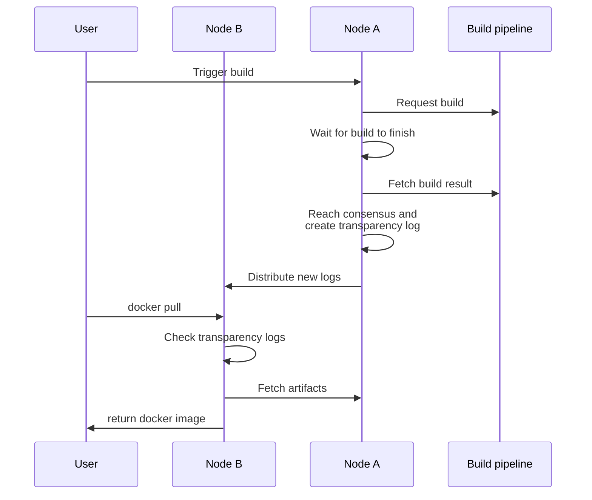

# Pyrsia demo: build Docker images from source

> **Warning:** This tutorial is aimed at developers actively contributing to the
> Pyrsia codebase. If you simply want to use Pyrsia, please have a look at [Configure Docker to use Pyrsia](/docs/tutorials/docker.md)

This tutorial describes how to setup two Pyrsia nodes: one that acts as the authorized
node and builds Docker images from source and makes them available in the Pyrsia network,
and another one that acts as a regular Pyrsia node, retrieving the transparency
logs and the Docker image from the Pyrsia network. \

> Note: in the current prototype, the build pipeline does not actually build the
image, but downloads them from Docker Hub instead.

The following scenario will be used:

- Setup an 'authorized' node: node A
- Setup a regular node: node B
- Set up a build pipeline (prototype) for node A and configure it to use it.
- Trigger a build from source for a given artifact
- Wait for the build to finish in the build pipeline
- Try to reach consensus with the other authorized nodes, which have to run the
  same build and verify they produce the same build result. (There's only one
  authorized node, so this is 'light' consensus for now)
- Create a transparency log about the artifact publication
- Publish the artifact on the p2p network
- Inspect the transparency log on any node
- Use docker pull using node B to pull the docker image from the Pyrsia network



See the [architecture and use-cases](pyrsia-architecture-and-use-cases.md)
document for more information.

## Compile Pyrsia

> If you build for the first time or face any issues at this step,
see the [Development Environment](../community/get_involved/local_dev_setup.md) document.

Download a fresh copy of the codebase by cloning the repo or updating to the
HEAD of `main`.

```sh
git clone https://github.com/pyrsia/pyrsia.git
```

Let's call this folder `PYRSIA_HOME`. We will refer to this
name in the following steps.

Build binaries by running:

```sh
cd $PYRSIA_HOME
cargo build --workspace
```

## Run Pyrsia node A

Now we will set the following env vars and start a pyrsia node:

- RUST_LOG: to make sure we can see all the debug logs
- DEV_MODE: to make sure all non-existing directories are created on-the-fly
- PYRSIA_ARTIFACT_PATH: pointing to a directory to store artifacts. optionally
  remove this directory prior to starting Pyrsia if you want to start from an
  empty state.

For the purpose of this demo, let's create temporary directories to clearly
separate our two nodes:

```sh
mkdir nodeA
cp target/debug/pyrsia_node nodeA
cd nodeA
```

And then run node A in listen-only and init mode, listening on a non-default port (because
we will run node B with default settings).

```sh
RUST_LOG=pyrsia=debug DEV_MODE=on \
./pyrsia_node --pipeline-service-endpoint http://localhost:8080 -p 7889 --listen-only --init-blockchain
```

Watch out for this kind of log:

```text
INFO  pyrsia::network::event_loop > Local node is listening on "/ip4/127.0.0.1/tcp/56662/p2p/12D3KooWBgWeXNT1EKXo2omRhZVmkbvPgzZ5BcGjTfgKr586BSAn"
```

It contains the p2p multiaddress of node A, which we will need when starting node
B later in this tutorial.

As you can see, we specified the `--pipeline-service-endpoint` argument to point
to `http://localhost:8080`, which is where we will run our build pipeline prototype
(see below). In a production setup, the build pipeline needs to run on its
own isolated infrastructure.

## Run build pipeline prototype

In this demo, we use a build pipeline prototype. Eventually, Pyrsia will use
industry-standard build pipeline solutions. Integration with such solutions is
currently being investigated.

The most important features of the build pipeline are:

- it runs completely separate from the Pyrsia node
- it exposes an interface so Pyrsia can start a build
- it exposes an interface so Pyrsia can download the build output

The current build pipeline prototype supports Maven and Docker builds.

Download or clone the [prototype repo](https://github.com/tiainen/pyrsia_build_pipeline_prototype)
and run as follows (`jq` must be installed locally before):

```sh
cd pyrsia_build_pipeline_prototype
RUST_LOG=debug cargo run
```

By default, this prototype listens on http port 8080. If you run it on a different
host or port, make sure to specify its location when starting the Pyrsia node
with `--pipeline-service-endpoint` (see above).

You will see the following output indicating that the build pipeline is ready
for use

```text
   Finished dev [unoptimized + debuginfo] target(s) in 1m 07s
     Running `target/debug/pyrsia_build`
 INFO  actix_server::builder > Starting 8 workers
 INFO  actix_server::server  > Tokio runtime found; starting in existing Tokio runtime
```

## Authorize node A as a build node

We will use the Pyrsia CLI to authorize node A as a build node.
Since node A is running on port 7889, we will have to edit the Pyrsia CLI config:

In a new terminal, while the Pyrsia nodes and the build pipeline prototype are
running, run:

```sh
cd $PYRSIA_HOME/target/debug
./pyrsia config -e --port 7889
```

Next you'll need to find out the peer id of node A. You can see that in its logs
or you can query the `/status` endpoint like this: (assuming you have `jq` installed)

```shell
curl -s http://localhost:7889/status | jq  .peer_id
```

Once you know the peer id, authorize it like this:

```shell
./pyrsia authorize --peer <PEER_ID>
```

## Run Pyrsia node B

Now it's time to run our regular node: node B. Let's create another temporary
directory to clearly separate it from node A.

```sh
mkdir nodeB
cp target/debug/pyrsia_node nodeB
cd nodeB
```

And then run node B with default settings and connecting it to the multiaddress
of node A. This multiaddress can be found in the logs of node A (see section
"Run Pyrsia node A" above).

```sh
RUST_LOG=pyrsia=debug DEV_MODE=on \
./pyrsia_node --peer /ip4/127.0.0.1/tcp/56662/p2p/12D3KooWBgWeXNT1EKXo2omRhZVmkbvPgzZ5BcGjTfgKr586BSAn
```

**Important**: do not simply copy/paste this command, the multiaddress on your
local system will be different.

At this point, we are running a Pyrsia network consisting of two nodes, so
let's continue building an artifact and providing it on the network.

## Trigger a build from source for a given artifact

In this section we will trigger a build for `alpine:3.16` on node A.

We will use the Pyrsia CLI to trigger a build from source. We can send the build
request to node B, which will relay the request to node A, which is an authorized
build node. Node B, which is running on port 7888, we will have to edit this config
again:

In a new terminal, while the Pyrsia nodes and the build pipeline prototype are
running, run:

```sh
cd $PYRSIA_HOME/target/debug
./pyrsia config -e --port 7888
```

Then trigger the build from source, like this:

```sh
./pyrsia build docker --image alpine:3.16.0
```

The build trigger should return immediately providing a build ID:

```text
Build request successfully handled. Build with ID 'c9ca3e57-aa84-4fab-a8be-381ab31e4916' has been started.
```

## Wait for the build to finish in the build pipeline

In the Pyrsia node logs of node A, you will see that a build has been started and
the Pyrsia node is now waiting for its result:

```text
INFO  pyrsia_registry > 127.0.0.1:50187 "POST /build/docker HTTP/1.1" 200 "-" "-" 42.826041ms
DEBUG pyrsia::build_service::service > Updated build info: BuildInfo { id: "c9ca3e57-aa84-4fab-a8be-381ab31e4916", status: Running }
```

In the build pipeline prototype you should see that build starting:

```text
#######################################################
#
# Starting Docker build for:
#   alpine:3.16.0
#
#######################################################
...
```

Do note that the build pipeline prototype will not actually build the docker image,
but instead download it from Docker Hub.

Once the build has finished, the status request from the Pyrsia node will contain:

```text
DEBUG pyrsia::build_service::event   > Handle BuildEvent: Result { build_id: "c9ca3e57-aa84-4fab-a8be-381ab31e4916", build_trigger: FromSource, build_result: BuildResult { package_type: Docker, package_specific_id: "alpine:3.16.0", artifacts: [BuildResultArtifact { artifact_specific_id: "alpine:3.16.0", artifact_location: "/private/tmp/pyrsia/builds/c9ca3e57-aa84-4fab-a8be-381ab31e4916/4ff3ca91275773af45cb4b0834e12b7eb47d1c18f770a0b151381cd227f4c253", artifact_hash: "4ff3ca91275773af45cb4b0834e12b7eb47d1c18f770a0b151381cd227f4c253" }, BuildResultArtifact { artifact_specific_id: "alpine@sha256:4ff3ca91275773af45cb4b0834e12b7eb47d1c18f770a0b151381cd227f4c253", artifact_location: "/private/tmp/pyrsia/builds/c9ca3e57-aa84-4fab-a8be-381ab31e4916/4ff3ca91275773af45cb4b0834e12b7eb47d1c18f770a0b151381cd227f4c253", artifact_hash: "4ff3ca91275773af45cb4b0834e12b7eb47d1c18f770a0b151381cd227f4c253" }, BuildResultArtifact { artifact_specific_id: "alpine@sha256:2408cc74d12b6cd092bb8b516ba7d5e290f485d3eb9672efc00f0583730179e8", artifact_location: "/private/tmp/pyrsia/builds/c9ca3e57-aa84-4fab-a8be-381ab31e4916/2408cc74d12b6cd092bb8b516ba7d5e290f485d3eb9672efc00f0583730179e8", artifact_hash: "2408cc74d12b6cd092bb8b516ba7d5e290f485d3eb9672efc00f0583730179e8" }, BuildResultArtifact { artifact_specific_id: "alpine@sha256:e66264b98777e12192600bf9b4d663655c98a090072e1bab49e233d7531d1294", artifact_location: "/private/tmp/pyrsia/builds/c9ca3e57-aa84-4fab-a8be-381ab31e4916/e66264b98777e12192600bf9b4d663655c98a090072e1bab49e233d7531d1294", artifact_hash: "e66264b98777e12192600bf9b4d663655c98a090072e1bab49e233d7531d1294" }] } }
INFO  pyrsia::artifact_service::service > Build with ID c9ca3e57-aa84-4fab-a8be-381ab31e4916 completed successfully for package type Docker and package specific ID alpine:3.16.0
```

## Try to reach consensus with the other authorized nodes

Pyrsia node A will now try to reach consensus with the
other authorized nodes, but since we are only running one authorized node, this
step is implicit and node A will continue with the next steps: creating and
distributing the new transparency log.

## Create a transparency log about the artifact publication

When consensus has been reached, a transparency log is created for each built artifact.

```text
INFO  pyrsia::artifact_service::service > Adding artifact to transparency log: AddArtifactRequest { package_type: Docker, package_specific_id: "alpine:3.16.0", num_artifacts: 4, package_specific_artifact_id: "alpine:3.16.0", artifact_hash: "4ff3ca91275773af45cb4b0834e12b7eb47d1c18f770a0b151381cd227f4c253" }
INFO  pyrsia::artifact_service::service > Transparency Log for build with ID c9ca3e57-aa84-4fab-a8be-381ab31e4916 successfully created.
```

## Publish the artifact on the p2p network

As a final step in the build from source scenario, the artifacts are stored locally
on node A and provided on the p2p network.

```text
INFO  pyrsia::artifact_service::service > put_artifact with id: 40ed45f7-8288-4af2-bcd3-d18a375e0129
INFO  pyrsia::artifact_service::storage > An artifact is being pushed to the artifact manager 40ed45f7-8288-4af2-bcd3-d18a375e0129
DEBUG pyrsia::network::client           > p2p::Client::provide "40ed45f7-8288-4af2-bcd3-d18a375e0129"
```

Now we are ready to use the published artifacts in our build workflow on node B
as shown in the sample section below.

## Use Pyrsia with Docker pull

Now that we have a Pyrsia network including a published Docker image, we can start
using Pyrsia with Docker.

### Configure Docker desktop to use node B as registry mirror

On Windows or MacOS, open your Docker desktop installation -> Settings ->
Docker Engine where Docker allows you to set registry-mirrors. Configure node B
as a registry mirror by adding/editing the following in the configuration:

```jsonc
 "registry-mirrors": [
   "http://192.168.0.110:7888" // (IP address of host machine and port number of your Pyrsia node)
 ]
```

On Linux, you'll find this configuration in the file `/etc/docker/daemon.json`.

On MacOS or Windows, you can't specify `localhost` because the request will
originate from the Docker Desktop VM, so you will need to specify the IP
address of host machine. On Linux you can use localhost.

You will need to restart Docker Desktop. Once restarted you should be able to
pull Docker images through Pyrsia.

## Pull `alpine` docker image

First make sure Alpine is not in local Docker cache, then pull Alpine:

```sh
docker rmi alpine:3.16.0 # remove alpine from local docker cache
docker pull alpine:3.16.0
```

You'll see this in the Pyrsia logs of node B:

```text
INFO  pyrsia_registry                      > 127.0.0.1:57054 "GET /v2/ HTTP/1.1" 200 "-" "docker/20.10.21 go/go1.18.7 git-commit/3056208 kernel/5.15.0-56-generic os/linux arch/amd64 UpstreamClient(Docker-Client/20.10.21 \(linux\))" 103.551µs
DEBUG pyrsia::docker::v2::handlers::manifests > Fetching manifest for library/alpine:3.16.0
INFO  pyrsia::artifact_service::storage       > An artifact is being pulled from the artifact manager 40ed45f7-8288-4af2-bcd3-d18a375e0129
DEBUG pyrsia::network::client                 > p2p::Client::list_providers "40ed45f7-8288-4af2-bcd3-d18a375e0129"
DEBUG pyrsia::network::client                 > p2p::Client::get_idle_peer() entered with 1 peers
DEBUG pyrsia::network::idle_metric_protocol   > p2p::idle_metric_protocol::write_request writing a request to peer for and idle metric
DEBUG pyrsia::network::idle_metric_protocol   > p2p::idle_metric_protocol::read_response Reading response to idle metric request with value =[227, 165, 155, 36, 140, 93, 136, 65]
DEBUG pyrsia::network::client                 > p2p::Client::get_idle_peer() Pushing idle peer with value 51097988.576
DEBUG pyrsia::network::client                 > p2p::Client::request_artifact PeerId("12D3KooWLbLd3V8iNekBntCgeoL4LuFkSEuDUDjLciqKmtXSuKXR"): "40ed45f7-8288-4af2-bcd3-d18a375e0129"
DEBUG pyrsia::network::artifact_protocol      > Write ArtifactRequest: "40ed45f7-8288-4af2-bcd3-d18a375e0129"
INFO  pyrsia::artifact_service::service       > put_artifact with id: 40ed45f7-8288-4af2-bcd3-d18a375e0129
INFO  pyrsia::artifact_service::storage       > An artifact is being pushed to the artifact manager 40ed45f7-8288-4af2-bcd3-d18a375e0129
INFO  pyrsia::artifact_service::storage       > An artifact is being pulled from the artifact manager 40ed45f7-8288-4af2-bcd3-d18a375e0129
```

Indicating that the Alpine image was first pulled from the Pyrsia network and then
stored locally, so node B can now also participate in the p2p content distribution.

## Inspect the transparency logs

The transparency logs that were created as part of the build from source process,
can be inspected using the Pyrsia CLI.

```sh
./pyrsia inspect-log docker --image alpine:3.16.0
```

This CLI command returns the transparency logs for all the Pyrsia artifacts that
make up the Docker image `alpine:3.16.0`:

```text
[
  {
    "artifact_hash": "4ff3ca91275773af45cb4b0834e12b7eb47d1c18f770a0b151381cd227f4c253",
    "artifact_id": "40ed45f7-8288-4af2-bcd3-d18a375e0129",
    "id": "3ad6eb47-5aad-4918-b2b1-6f1f114e393c",
    "node_id": "8cafff66-c9b6-4236-8439-b94d48c8892b",
    "node_public_key": "01b12113-550c-4662-b26e-6b4896ad1e06",
    "num_artifacts": 4,
    "operation": "AddArtifact",
    "package_specific_artifact_id": "alpine:3.16.0",
    "package_specific_id": "alpine:3.16.0",
    "package_type": "Docker",
    "source_hash": "",
    "source_id": "cd739bcc-a8cc-49f6-99cd-a5935a4e3708",
    "timestamp": 1671002963
  },
  {
    "artifact_hash": "4ff3ca91275773af45cb4b0834e12b7eb47d1c18f770a0b151381cd227f4c253",
    "artifact_id": "b825cf46-cdff-4e42-9ac9-30e2cf006768",
    "id": "5cfdd284-bdf9-4106-b613-645280ac1e9d",
    "node_id": "4d3e0ae6-9249-45d4-bb07-c87ab896b401",
    "node_public_key": "f6cb371d-fcc4-48ef-aafa-96e03d4cb350",
    "num_artifacts": 4,
    "operation": "AddArtifact",
    "package_specific_artifact_id": "alpine@sha256:4ff3ca91275773af45cb4b0834e12b7eb47d1c18f770a0b151381cd227f4c253",
    "package_specific_id": "alpine:3.16.0",
    "package_type": "Docker",
    "source_hash": "",
    "source_id": "cf598576-ceab-4c72-903b-e2fd1bd7f6fd",
    "timestamp": 1671002963
  },
  {
    "artifact_hash": "2408cc74d12b6cd092bb8b516ba7d5e290f485d3eb9672efc00f0583730179e8",
    "artifact_id": "7bf372eb-7b27-473d-a42a-870c193716a2",
    "id": "a6a06cfb-f446-4550-861d-d852f1159173",
    "node_id": "30f770ab-ad97-4373-9cd2-1aa3b1462544",
    "node_public_key": "45b15873-a4b5-4f14-ab8c-f808637942d6",
    "num_artifacts": 4,
    "operation": "AddArtifact",
    "package_specific_artifact_id": "alpine@sha256:2408cc74d12b6cd092bb8b516ba7d5e290f485d3eb9672efc00f0583730179e8",
    "package_specific_id": "alpine:3.16.0",
    "package_type": "Docker",
    "source_hash": "",
    "source_id": "0698a48a-5417-4c9a-9dd1-847e8a50d97b",
    "timestamp": 1671002963
  },
  {
    "artifact_hash": "e66264b98777e12192600bf9b4d663655c98a090072e1bab49e233d7531d1294",
    "artifact_id": "8e453f52-eb25-4115-aaa1-21336e621b5d",
    "id": "9891becb-0d51-4a84-8a95-1a2a373c3057",
    "node_id": "5ff4828c-afc0-4bf1-a69a-b43b25702906",
    "node_public_key": "6140db75-b98e-406b-8149-03cea4bb3494",
    "num_artifacts": 4,
    "operation": "AddArtifact",
    "package_specific_artifact_id": "alpine@sha256:e66264b98777e12192600bf9b4d663655c98a090072e1bab49e233d7531d1294",
    "package_specific_id": "alpine:3.16.0",
    "package_type": "Docker",
    "source_hash": "",
    "source_id": "90bde21b-a126-484e-83da-e70783c2a300",
    "timestamp": 1671002963
  }
]
```
