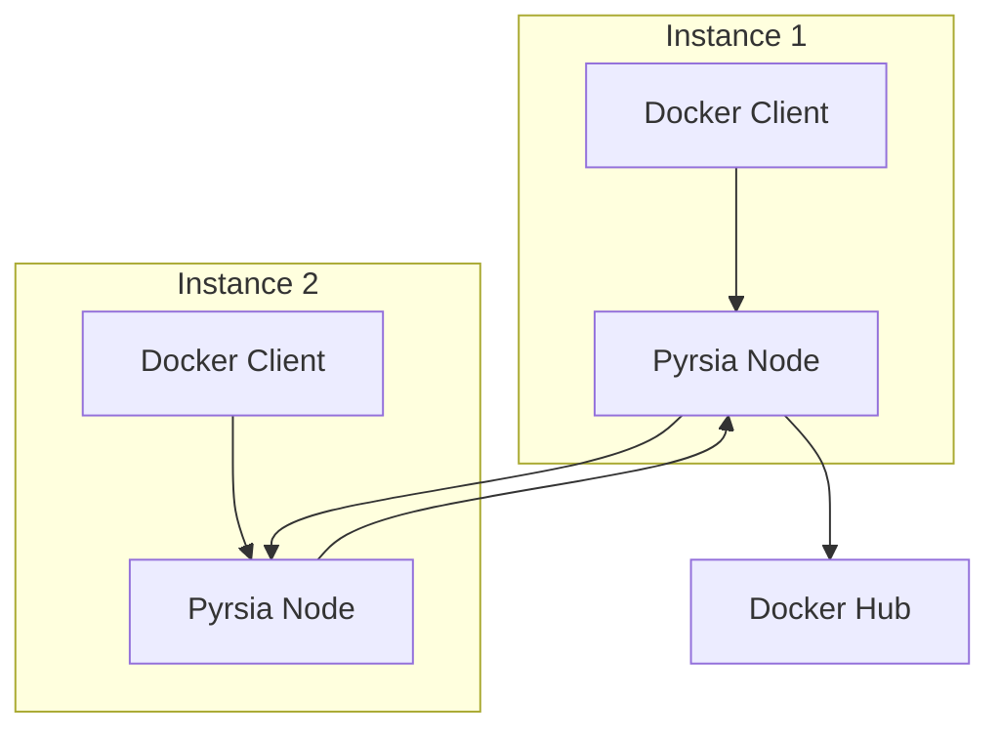
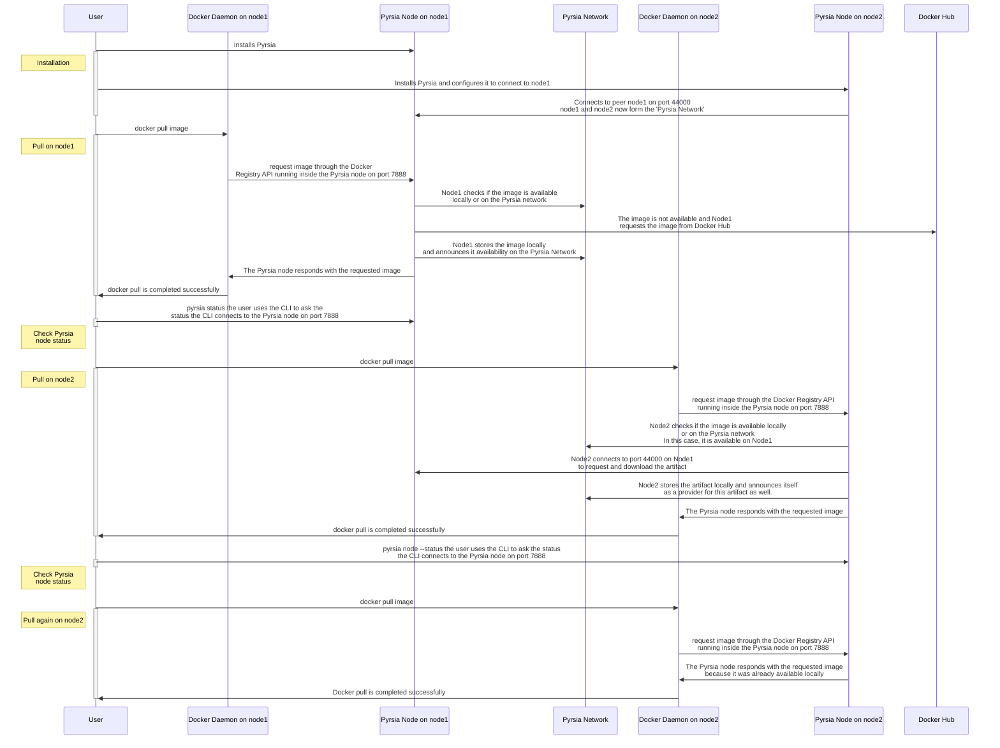

# Demo on two Ubuntu instances

This demo tutorial is a first step in demonstrating Pyrsia's capabilities.
You will setup two Pyrsia nodes on two separate Ubuntu instances, wire them
together in a very small p2p network, and use the regular Docker client on
Ubuntu to pull images off the Pyrsia network. The Pyrsia nodes use Docker Hub
as a fallback mechanism in case the image is not yet available in the Pyrsia
network.



## Prerequisites

- Two Ubuntu instances with public IPs that allow inbound TCP traffic on port 44000.
We will refer to them as:
  - `node1`
  - `node2`

- We assume you have Docker installed. Follow these [instructions](https://docs.docker.com/engine/install/ubuntu/) if you do not.

> If you ran these steps before and if you want to start from a clean sheet, do this:
>
> ```sh
> apt-get remove pyrsia
> rm -rf /usr/local/var/pyrsia
> ```

## Demo Scenario

This demo consists of several steps: (scroll down for instructions)

1. [Installation and configuration](#install-and-configure-pyrsia)
   - Install and configure Pyrsia on `node1`
   - Install and configure Pyrsia on `node2`, make it connect to `node1`
2. [Docker pull on `node1`](#use-pyrsia)
   - image is not available in the Pyrsia network
   - image is requested from Docker Hub and stored locally, so it becomes
      available in the Pyrsia network
3. [Use the Pyrsia CLI to check `node1` status](#use-the-cli-to-check-the-node-status)
4. [Docker pull on `node2`](#use-pyrsia)
   - The same Docker image is pulled on `node2`
   - `node2` requests the image from the Pyrsia network, in this specific case: `node1`.
5. [Use the Pyrsia CLI to check `node2` status](#use-the-cli-to-check-the-node-status)
6. [Docker pull on `node2`](#use-pyrsia)
   - The same Docker image is pulled again on `node2`
   - `node2` doesn't have to download the image again

These are the steps in more detail:



## Install and configure Pyrsia

> IMPORTANT: run the installation phase as `root`.

**On both instances:**

### Install Pyrsia

Follow the instructions below or have a look at the latest [Pyrsia documentation](https://pyrsia.io/docs/tutorials/quick-installation/).

```sh
curl -sS https://pyrsia.io/install.sh | sh
```

or run the commands listed below:

```sh
# Update system and install base tooling
sudo apt-get update
sudo apt-get install -y wget gnupg

# Add the Pyrsia keys to verify packages
wget -q -O - https://repo.pyrsia.io/repos/Release.key |  gpg --dearmor  > pyrsia.gpg
sudo install -o root -g root -m 644 pyrsia.gpg /etc/apt/trusted.gpg.d/
rm pyrsia.gpg
echo "deb https://repo.pyrsia.io/repos/nightly focal main" | sudo tee -a /etc/apt/sources.list > /dev/null
sudo apt-get update

# Install
sudo apt-get install -y pyrsia
```

### Edit configuration

Both nodes will already be listening on port 44000 when it starts.
Let's now edit the configuration on node2 to connect to node1 at startup.

**On `node2`:**

Edit `/etc/systemd/system/multi-user.target.wants/pyrsia.service` and add
`--peer /ip4/public_ip_of_node1/tcp/44000` to the `ExecStart` line so it looks
like this:

```sh
ExecStart=/usr/bin/pyrsia_node --host 0.0.0.0 -L /ip4/0.0.0.0/tcp/44000 --peer /ip4/public_ip_of_node1/tcp/44000
```

This will make sure `node2` connects to peer `node1` when it starts.

Reload the daemon configuration:

```sh
systemctl daemon-reload
```

Restart the Pyrsia node:

```sh
service pyrsia restart
```

Check the daemon status:

```sh
service pyrsia status
```

You should see something very similar to:

```sh
● pyrsia.service - Pyrsia Node
     Loaded: loaded (/lib/systemd/system/pyrsia.service; enabled; vendor preset: enabled)
     Active: active (running) since Wed 2022-03-23 14:29:55 UTC; 5min ago
   Main PID: 42619 (pyrsia_node)
      Tasks: 11 (limit: 19189)
     Memory: 3.4M
     CGroup: /system.slice/pyrsia.service
             └─42619 /usr/bin/pyrsia_node -H 127.0.0.1 --peer /ip4/1.2.3.4/tcp/44000 -L /ip4/0.0.0.0/tcp/44000
```

### Use the CLI to check the node status

Check the node status:

```sh
pyrsia -s
```

You should see something very similar to:

```sh
Connected Peers Count:       1
Artifacts Count:             3 {"manifests": 1, "blobs": 2}
Total Disk Space Allocated:  5.84 GB
Disk Space Used:             0.0002%
```

List the node's peers:

```sh
pyrsia -l
```

You should see something very similar to:

```sh
Connected Peers:
["12D3KooWMD9ynPTdvhWMcdX7mh23Au1QpVS3ekTCQzpRTtd1g6h3"]
```

### Tail the log

```sh
tail -f /var/log/syslog
```

You should see something very similar to:

```sh
Mar 23 14:37:08 demo-pyrsia-node-2 pyrsia_node[42678]:  DEBUG multistream_select::dialer_select > Dialer: Proposed protocol: /ipfs/id/1.0.0
Mar 23 14:37:08 demo-pyrsia-node-2 pyrsia_node[42678]:  DEBUG multistream_select::dialer_select > Dialer: Received confirmation for protocol: /ipfs/id/1.0.0
Mar 23 14:37:08 demo-pyrsia-node-2 pyrsia_node[42678]:  DEBUG libp2p_core::upgrade::apply       > Successfully applied negotiated protocol
Mar 23 14:37:08 demo-pyrsia-node-2 pyrsia_node[42678]: Identify::Received: 12D3KooWMD9ynPTdvhWMcdX7mh23Au1QpVS3ekTCQzpRTtd1g6h3; IdentifyInfo { public_key: Ed25519(PublicKey(compressed): a94721f6a984901ec913ca8fac3963103f9f5f45fa5c484e9df8db469ab1e), protocol_version: "ipfs/1.0.0", agent_version: "rust-libp2p/0.34.0", listen_addrs: ["/ip4/1.1.1.1/tcp/44000", "/ip4/127.0.0.1/tcp/44000", "/ip4/10.128.0.14/tcp/44000", "/ip4/172.17.0.1/tcp/44000"], protocols: ["/ipfs/id/1.0.0", "/ipfs/id/push/1.0.0", "/ipfs/kad/1.0.0", "/file-exchange/1"], observed_addr: "/ip4/2.2.2.2/tcp/52012" }
Mar 23 14:37:08 demo-pyrsia-node-2 pyrsia_node[42678]:  DEBUG pyrsia::network::p2p  > Identify::Received: adding address "/ip4/34.66.158.102/tcp/44000" for peer 12D3KooWMD9ynPTdvhWMcdX7mh23Au1QpVS3ekTCQzpRTtd1g6h3
Mar 23 14:37:08 demo-pyrsia-node-2 pyrsia_node[42678]:  INFO  pyrsia::network::handlers         > Dialed "/ip4/34.66.158.102/tcp/44000"
```

## Use Pyrsia

Keep the log tail from the installation phase running and open a new terminal
on both instances. (doesn’t have to be `root`)

First on `node1`, pull any Docker image:

```sh
docker pull alpine
```

(make sure to remove it from the local Docker cache if you already pulled it
before: `docker rmi alpine`)

Look at the syslog to show what happened. Alternatively grep the syslog for ‘Step’.

```sh
cat /var/log/syslog | grep Step
> Step 1: Does "sha256:e9adb5357e84d853cc3eb08cd4d3f9bd6cebdb8a67f0415cc884be7b0202416d" exist in the artifact manager?
> Step 1: NO, "sha256:e9adb5357e84d853cc3eb08cd4d3f9bd6cebdb8a67f0415cc884be7b0202416d" does not exist in the artifact manager.
> Step 3: Retrieving "sha256:e9adb5357e84d853cc3eb08cd4d3f9bd6cebdb8a67f0415cc884be7b0202416d" from docker.io
> Step 3: "sha256:e9adb5357e84d853cc3eb08cd4d3f9bd6cebdb8a67f0415cc884be7b0202416d" successfully stored locally from docker.io
> Final Step: "sha256:e9adb5357e84d853cc3eb08cd4d3f9bd6cebdb8a67f0415cc884be7b0202416d" successfully retrieved!
> Step 3: "sha256:3d243047344378e9b7136d552d48feb7ea8b6fe14ce0990e0cc011d5e369626a" successfully stored locally from docker.io
 > Final Step: "sha256:3d243047344378e9b7136d552d48feb7ea8b6fe14ce0990e0cc011d5e369626a" successfully retrieved!
```

It shows that Pyrsia didn’t have the image yet, but it fetched it from Docker Hub instead.

Next on `node2`, pull the same Docker image:

```sh
docker pull alpine
```

Inspect the syslog on `node2`, or grep for ‘Steps’:

```sh
> Step 1: Does "sha256:e9adb5357e84d853cc3eb08cd4d3f9bd6cebdb8a67f0415cc884be7b0202416d" exist in the artifact manager?
> Step 1: Does "sha256:3d243047344378e9b7136d552d48feb7ea8b6fe14ce0990e0cc011d5e369626a" exist in the artifact manager?
> Step 1: NO, "sha256:e9adb5357e84d853cc3eb08cd4d3f9bd6cebdb8a67f0415cc884be7b0202416d" does not exist in the artifact manager.
> Step 1: NO, "sha256:3d243047344378e9b7136d552d48feb7ea8b6fe14ce0990e0cc011d5e369626a" does not exist in the artifact manager.
> Step 2: Does "sha256:3d243047344378e9b7136d552d48feb7ea8b6fe14ce0990e0cc011d5e369626a" exist in the Pyrsia network?
> Step 2: Does "sha256:e9adb5357e84d853cc3eb08cd4d3f9bd6cebdb8a67f0415cc884be7b0202416d" exist in the Pyrsia network?
> Step 2: YES, "sha256:e9adb5357e84d853cc3eb08cd4d3f9bd6cebdb8a67f0415cc884be7b0202416d" exists in the Pyrsia network.
> Step 2: "sha256:e9adb5357e84d853cc3eb08cd4d3f9bd6cebdb8a67f0415cc884be7b0202416d" successfully stored locally from Pyrsia network.
> Final Step: "sha256:e9adb5357e84d853cc3eb08cd4d3f9bd6cebdb8a67f0415cc884be7b0202416d" successfully retrieved!
> Step 2: YES, "sha256:3d243047344378e9b7136d552d48feb7ea8b6fe14ce0990e0cc011d5e369626a" exists in the Pyrsia network.
> Step 2: "sha256:3d243047344378e9b7136d552d48feb7ea8b6fe14ce0990e0cc011d5e369626a" successfully stored locally from Pyrsia network.
> Final Step: "sha256:3d243047344378e9b7136d552d48feb7ea8b6fe14ce0990e0cc011d5e369626a" successfully retrieved!
```

This shows the image wasn't available locally, but it was available in the
Pyrsia network, retrieved and stored locally.

Next, remove the image from the local docker cache, and retrieve it again:

```sh
docker rmi alpine
docker pull alpine
```

Inspect the syslog on `node2` again:

```sh
> Step 1: YES, "sha256:e9adb5357e84d853cc3eb08cd4d3f9bd6cebdb8a67f0415cc884be7b0202416d" exist in the artifact manager.
> Final Step: "sha256:3d243047344378e9b7136d552d48feb7ea8b6fe14ce0990e0cc011d5e369626a" successfully retrieved!
> Final Step: "sha256:e9adb5357e84d853cc3eb08cd4d3f9bd6cebdb8a67f0415cc884be7b0202416d" successfully retrieved!
```

It will show the local Pyrsia node already had this Docker image and didn’t
have to download it again. Inspect the Pyrsia node status again on both nodes:

```sh
pyrsia -s
```

You should see something very similar to:

```sh
Connected Peers Count:       1
Artifacts Count:             3 {"manifests": 1, "blobs": 2}
Total Disk Space Allocated:  5.84 GB
Disk Space Used:             0.0002%
```
