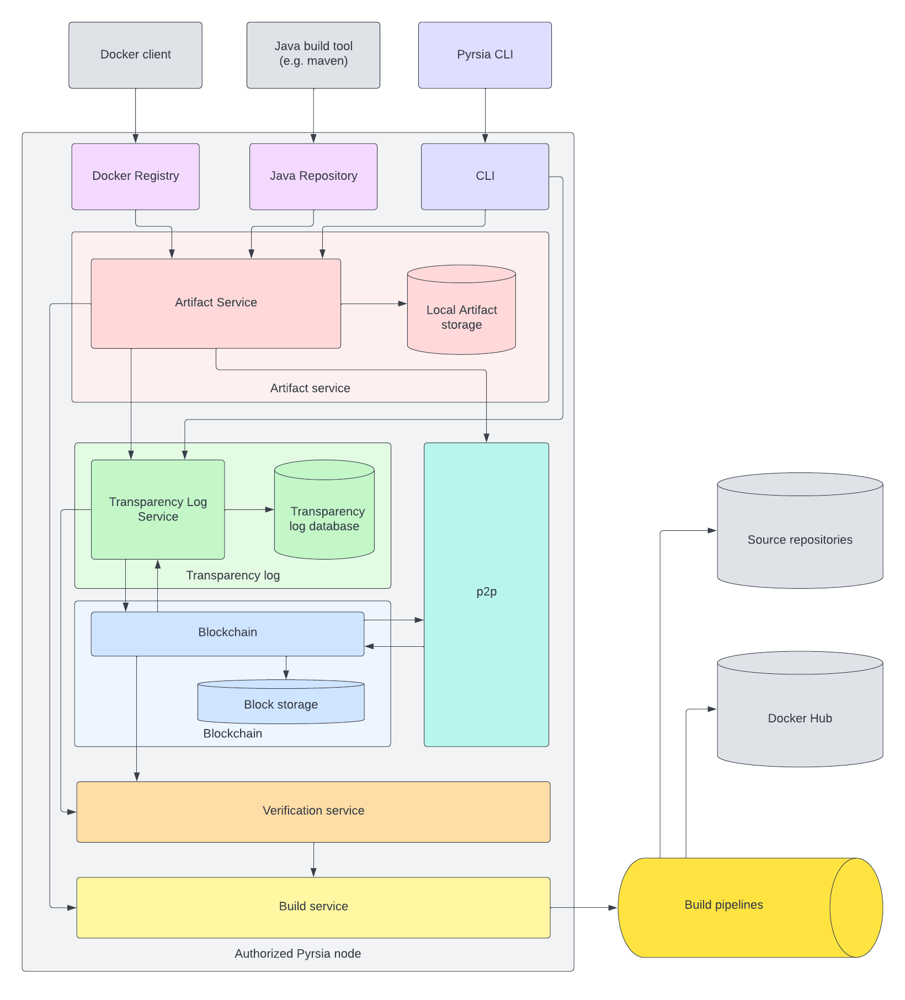

# Pyrsia architecture and use cases

> **Warning:** This document is a work-in-progress.

## Concepts used in this document

- Pyrsia network: a peer-to-peer network of interconnected nodes exchanging software
  packages and transparency logs.
- Node: a process participating the Pyrsia network, either as an authorized node
  or a regular node.
- Authorized node: a Node authorized to participate in the consensus algorithm to
  verify transactions
- Regular node: a Node using the network to download and validate software packages
- Transparency log: information about every operation on the Pyrsia network, like
  adding or removing an artifact, but also about adding or removing authorized nodes.
  A transparency log is stored as the payload of a blockchain transaction.
- Blockchain : a distributed ledger including all the transactions in the Pyrsia
  network
- Block: a record of the distributed ledger including one or more transactions
- Transaction: a record in the block, containing the transparency log as the payload.
- Consensus: consensus establishes the agreement between authorized nodes that a
  transaction is valid.
- Artifact: a single file that can be retrieved from the Pyrsia network. It does
  not necessarily coincide with package specific artifacts.
- Package ecosystem: a specific package ecosystem that Pyrsia supports. e.g. Java,
  Docker, ...
- Package type: the type of a package in a specific package ecosystem. e.g. jars
  for Java, Docker images for Docker, ...
- PSID: a package type specific artifact ID.
- Authorized node admin: the person who can administer an authorized node

## Introduction

The Pyrsia network's first aim is to distribute software packages without central
authority. Instead, it relies on a set of designated authorized nodes that reach
consensus about the publication of software packages.

Those software packages originate from a source repository with build instructions.
All authorized nodes perform the necessary build steps and reach consensus if the
produced build is identical (or at least identical for the parts that matter).

**Note**: The Docker build pipeline will leverage Docker Hub builds for the
official Docker images.

The Pyrsia network also distributes transparency logs so every node in the network
can verify a downloaded artifact.

## High level user stories

- As a user I can use Docker client to pull an official Docker image from the Pyrsia
  network.
- As a user I can use a Java build tool like Maven to download Maven artifacts from
  the Pyrsia network.
- As a user I can use the Pyrsia CLI to show the transparency log based on search
  parameters.
- New authorized nodes can be added to the Pyrsia network.
- As a user I can request a build from source of a specific artifact, so it is
  added to the Pyrsia network.

## Pyrsia network overview

The following diagram shows three authorized nodes, each with their own build pipelines.
In a real network, we expect tens or even hundreds of authorized nodes.

The next diagram show the same authorized nodes. But next to those, a larger number
of regular nodes have now joined the network as well. While regular nodes don't
participate in the consensus mechanism, they do participate in the distribution
of artifacts and transparency logs. They play a crucial role in the performance
of the Pyrsia network.

## Pyrsia node architecture

### Package ecosystem integrations

A Pyrsia node contains several integrations for specific package ecosystems
like Docker or Maven. The ecosystem integrations allow the existing tooling of a
specific package type to seamlessly integrate with Pyrsia. e.g. the Docker
repository service implements a subset of the Docker Registry API or the Java
repository service implements a subset of the Maven repository API.

The end goal of a such an integration service is always a frictionless integration
of Pyrsia in the developer's workflow.

Different package type integrations deal with package specific details in a different
way. But all must follow the same logic:

- Handle incoming requests from the package type specific clients (e.g. Docker
  client, Maven client, ...)
- Use the artifact service to retrieve the artifact. (The artifact service
  contains all the logic to retrieve (locally or from the p2p network) and validate
  the artifact.)

### Pyrsia CLI API

The Pyrsia CLI API is the entry point into the Pyrsia node for the Pyrsia
command line tool. It supports all kinds of management operations and inspecting
transparency logs.

The Pyrsia CLI API has functions to:

- retrieve and change node configuration
- request status information about the local artifact storage
- request status information about the p2p connection status
- request the addition of a new authorized node (_Authorized nodes only_)
- request starting a new build from source

### Artifact Service

The artifact service is the component that handles everything related to Pyrsia
artifacts. It allows artifacts to be retrieved, and it allows artifacts to be
added to the Pyrsia network, by triggering a build from source.

The artifact service provides these functions:

- get an artifact based on the package type and a package specific
  artifact ID (PSID). \
  the artifact service implements this as follows:
  - get the latest available `add_artifact`transparency log (if any) for this artifact
    from the transparency log service.
  - the transparency log contains the (Pyrsia) `artifact_id` which is used to retrieve
    the actual artifact file
  - if the file is available locally, it is used
  - if the file isn't available locally, it is retrieved using the `p2p` component.
  - the file is then checked by calculating its hash and comparing it to the
      `artifact_hash` stored in the transparency log.
  - if the hashes match the bytes of the file, they are returned to the caller of
      the artifact service, otherwise an error is returned.

- request a build from source for a specific package type and a package
  specific artifact ID (PSID). \
  the artifact service implements this as follows:
  - start a build using the build service, and wait for its result.
  - when the build is finished:
    - temporary hold the build result
    - and call the transparency log including the package type, PSID and
      the hashes from the build result to add an `add_artifact` transparency log.
      this call is asynchronous (because consensus will need to be reached about
      the transaction), so the artifact service will wait from a callback from
      the transparency log
    - when the call is received and the `add_artifact` succeeded, the artifact
      service stores the artifact locally in a file named `artifact_id` and the
      source in a file named `source_id`. Both files are provided on the p2p
      network using the `p2p` component.

### p2p

The p2p component offers an interface to the peer-to-peer network. This component
heavily relies on libp2p and bundles everything that is required to set up and
maintain a p2p network between Pyrsia nodes, allowing them to exchange messages,
artifacts and transparency logs.

### Transparency Log Service

This component is used by the artifact service to store and retrieve transparency
log information about an artifact.

It uses the blockchain component to retrieve transparency logs and to reach consensus
on the publication of new transparency logs. It uses a local database to store
and index transparency log information for easy access.

The transparency log service provides these functions:

- `add_artifact`: to add a transparency log, logging the addition of an artifact
   to the Pyrsia network. \
   It follows this procedure:
  - create a `TransparencyLog` including
    - operation: `add_artifact`
    - package type: provided by the `AddArtifactRequest`
    - package type specific artifact ID (PSID): provided by the `AddArtifactRequest`
    - timestamp: now
    - artifact_hash: provided by the `AddArtifactRequest`
    - source_bash: provided by the `AddArtifactRequest`
    - artifact_id: Pyrsia specific id of the artifact (UUID to be generated by
        the Transparency Log Service at the time of transparency log creation)
    - source_id: Pyrsia specific id of the artifact's source (UUID to be generated
        by the Transparency Log Service at the time of transparency log creation)
    - the transparency log is provided as the payload of the `add_transaction`
      method of the blockchain component. the service now waits for the blockchain
      component to reach consensus with the other authorized nodes.
    - when consensus is reached, the transparency log service will be notified
      by the blockchain component, which will:
      - store the transparency log in the transparency log database
      - notify the caller of `add_artifact`

- retrieving the latest `add_artifact` transparency log
  - this function takes the package type and PSID as input \
    and follows this procedure:
    - search the transparency log database for all transparency log with
      - operation: add_artifact or remove_artifact
      - package_type: given as a parameter to this method
      - package_type_id: the PSID also given as a parameter to this method
      - and sort on timestamp descending
    - if the latest transparency log is remove_artifact or no transparency log
      is found, an error is returned
    - otherwise the latest transparency log is returned

- retrieving current authorized nodes
  - this function is mainly used by the blockchain component to find out who
    the other authorized nodes are.

- searching transparency logs (for inspection)

- adding a transparency log to add another authorized node

- adding a transparency log to remove an authorized node

- adding a transparency log to remove an artifact

### Blockchain

This component offers an interface to store and retrieve immutable transparency
logs, and distribute them across all peers.

Before transparency logs can be added to the blockchain, consensus needs to be
reached using a fault-tolerant consensus algorithm, because:

- A majority of (authorized) nodes must be able to agree to the same result
- A small number of faulty (authorized) nodes must not be able to influence the
  result
- A small number of faulty (authorized) nodes must not be able to slow down the
  system or make it stop working

The blockchain component supports these functions:

- add_transaction(payload, callback) to request the addition of a new transaction
  - called by the transparency log service (payload can contain operation=add_artifact,
    add_node, etc)
    - the blockchain component receives this call, builds a block and communicates
      with other authorized nodes
    - if a consensus is reached, commit a new block
    - if a new block is committed, the blockchain module broadcasts the event add_block
      on the p2p network

- add_block_listener(callback): to register a listener for new payloads that reached
  consensus.
  - this function is used by the transparency log service
  - so it receives the payload of every committed payload

- when an authorized Pyrsia node needs to verify a block to reach consensus,
  the blockchain component will use the verification service to verify the payload
  of each transaction in the block. It's the responsibility of the verification
  service to inspect the payload and perform the necessary steps (e.g. start
  a build and verify its output)

### Verification service

The verification service is a component only used by authorized nodes. It implements all
necessary logic to verify blockchain transactions.

The verification service supports this function:

- `verify_transaction` verifies a transaction based on its payload \
  this function is called by the blockchain component to try and reach consensus
  on a transaction that was added by another authorized node by verifying the payload
  of that transaction.
  - based on the transparency log operation
    - if `add_node`
      - if the node was previously marked as a authorized node candidate, agree
          to the transaction
      - if not, do not agree to the transaction
    - if `add_artifact` perform these steps:
      - based on the package type (from the transparency log)
        - start a build using the build service and wait for the result
        - when the build finishes, hash the binary and source artifacts and compare
            them to the hashes in the transparency log
          - simple hashing might not be sufficient for non-reproducible builds
          - if the hashes match, return success to the caller of this function
          - TDB: how do we make sure all authorized nodes will store the build
                result?

### Build service

The build service is a component only used by authorized nodes. It is the entry
point to the authorized node's build pipeline infrastructure.

The builds service supports this function:

- start a build based on the package type and the PSID \
  this function is typically called from the CLI component when a build from
  source was requested by a user.
  - based on the package type it will:
    - map the PSID to a source repo (if necessary)
    - find a suitable build pipeline and trigger a build
    - wait for the build result
    - when the build finishes, hash the binary artifact and the source artifact
      - one build might produce multiple (Pyrsia) artifacts
      - for non-reproducible builds simple hashing will not be sufficient
    - return the build result (could be multiple: one per artifact) to the caller
      of the `start_build` (this will need to be an async callback) \
      the build result contains:
      - the binary artifact
      - the source artifact
      - the hash of the binary artifact
      - the hash of the source artifact

## Technical stories and details

- As a user I can use Docker client to pull an official Docker image from the Pyrsia
  network.

  - a Pyrsia node handles incoming requests from a Docker client **[DOCKER_REGISTRY]**

    This is the implementation of the Docker Registry API so a Docker client can
    seamlessly integrate with the Pyrsia node.

- As a user I can use a Java build tool like Maven to download Maven artifacts
  from the Pyrsia network.

  - a Pyrsia node handles incoming requests from a maven client **[JAVA_REPOSITORY]**

    This is the implementation of the Maven Repository API so several Java build
    tools can seamlessly integrate with the Pyrsia node.

- When an artifact is requested, the node verifies the existence in the Pyrsia
  network, and downloads it if necessary. **[ARTIFACT_SERVICE]**

  When an artifact is requested, the Artifact Service  will query the transparency
  log component. If the artifact exists (so if a log exists) the transparency log
  will contain a reference to the required p2p file.
  The artifact service will then lookup this file in its local storage, or download
  it from the p2p network.

- Any Pyrsia node that downloaded an artifact provides that artifact on the
  network for other nodes to download. **[ARTIFACT_SERVICE]**

- As a user I can configure my Pyrsia node to limit the network bandwidth usage
  or even disable downloads from other nodes. **[ARTIFACT_SERVICE]**

- As a Pyrsia node, I provide my locally stored artifacts in the Pyrsia network
  at boot. **[ARTIFACT_SERVICE]**

- As a user behind a NAT router, my node can participate in het Pyrsia network
  **[P2P]**

  In order to participate in a distributed peer-to-peer network, nodes need to be
  reachable by other nodes. This can be a challenge when a node is run behind a
  NAT router. There are multiple ways of NAT traversal like TCP hole punching
  that Pyrsia will try to accomplish. However, Pyrsia nodes will not relay
  traffic if none of the other traversal methods worked. In that case, the
  Pyrsia node can simply download artifacts from one or more of the authorized
  nodes, which will by definition always contain all the data.

- As a user I can use the Pyrsia CLI to show the transparency log. **[CLI]**

  including search on author/dependencies/...

- New authorized nodes can be added to the Pyrsia network. **[CLI]**
  **[TRANSPARENCY_LOG]** **[BLOCKCHAIN]**

  - As an authorized node admin I can add a candidate authorized node

    The authorized node marks the new node id as an authorized node 'candidate'
    and creates an `AddNode` transaction request and waits for consensus.
    Consensus might not be reached yet, but the authorized node keeps the
    candidate so a future transaction request from another authorized node might
    reach consensus.

- As a user I can request the addition of an official Docker Hub image to the
  Pyrsia network. **[CLI]** **[ARTIFACT_MANAGER]**

  - The Pyrsia node accepts "Docker image add requests" and as a result starts
    build pipeline and adds a Transaction request.

- As a user I can request a build from source of a specific artifact, so it is
  added to the Pyrsia network **[CLI]** **[ARTIFACT_MANAGER]**

  - The Pyrsia node accepts " Build from source requests" and as a result
    starts build pipeline and adds a Transaction request.

- When a Transaction request is received all authorized nodes participate in the
  consensus mechanism **[BLOCKCHAIN]**

  Other authorized nodes validate transactions based on the transaction's operation
  type. Examples of transaction operations:

  - `AddNode`: to add a new authorized node. see 'AddNode transaction requests
     are handled'
  - `RemoveNode`: to add a new authorized node. see 'RemoveNode transaction
     requests are handled'
  - `AddArtifact`: to add a new artifact. see 'AddArtifact transaction
     requests are handled'

- AddNode transaction requests are handled **[BLOCKCHAIN]**
  an `AddNode` transaction requests follows this procedure:

  - was the node previously marked as an authorized node candidate?
  - if yes, the authorized node answers positively in the consensus algorithm

- RemoveNode transaction requests are handled **[BLOCKCHAIN]**

  - was the node previously marked as an authorized node candidate for removal?
  - if yes, the authorized node answers positively in the consensus algorithm

- AddArtifact transaction requests are handled **[BLOCKCHAIN]**
  The AddArtifact transaction request triggers a build verification using the
  Build Service. The response of the Build Service defines the authorized
  node's answer in the consensus algorithm.

- When consensus is reached, the transaction is committed to the blockchain.
  **[BLOCKCHAIN]**

  As a result, all nodes must receive new transactions. The authorized nodes store
  the artifact locally and provide it in the p2p network.

- When a build is started, the Build Service finds a corresponding build pipeline
  suitable to run the build. **[BUILD_SERVICE]**

- When a build result is returned from a pipeline, the build service verifies
  the generated build (part 1: for reproducible builds) **[BUILD_SERVICE]**

- When a build result is returned from a pipeline, the build service verifies
  the generated build by doing a semantic analysis (part 2: for non-reproducible
  builds) **[BUILD_SERVICE]**

- On any Pyrsia node, when a new transaction is received, it is added to the
  transparency log so it can be used in verification scenarios
  **[TRANSPARENCY_LOG]**

- As a Pyrsia node, I make sure the transparency log is up-to-date when I
  boot. **[TRANSPARENCY_LOG]**

- As a Pyrsia node, I make sure the transparency log is kept up-to-date while
  running. **[TRANSPARENCY_LOG]**

- As a Pyrsia node, I can download an artifact from multiple other nodes
  simultaneously. **[P2P]**

- As a user I can measure the download via Pyrsia is faster than from a central
  repository. (benchmark) **[P2P]**

- As a user I can use Docker Desktop to install Pyrsia (Docker Desktop Pyrsia)
  **[INSTALLATION]**

- As a user I can use a package manager on Ubuntu to install Pyrsia **[INSTALLATION]**
