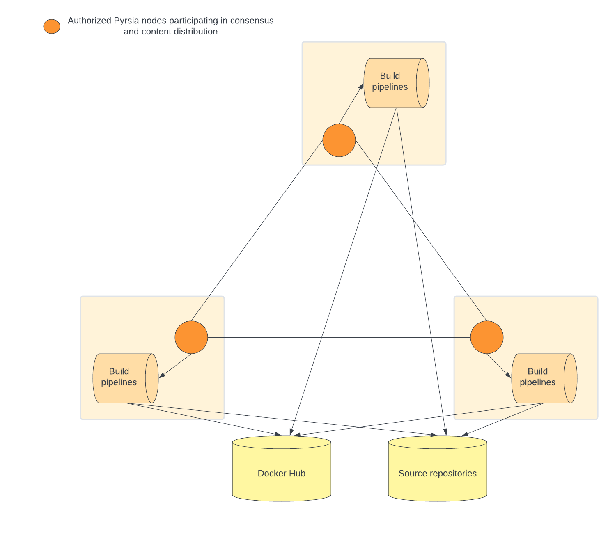

# Pyrsia architecture and use cases

## Concepts used in this document

- Pyrsia network: a peer-to-peer network of interconnected nodes exchanging software
  packages and transparency logs.
- Node: a process participating the Pyrsia network, either as an authorized node
  or a regular node.
- Authorized node: a Node authorized to participate in the consensus algorithm to
  verify transactions
- Regular node: a Node using the network to download and validate software packages
- Transaction: an operation in the transparency log. e.g. AddArtifact,
  AddAuthorizedNode, ...
- Consensus: consensus establihes the agreement between authorized nodes that a
  transaction is valid.
- Artifact: a single file that can be retrieved from the Pyrsia network. It does
  not necessarily coincide with package specific artifacts.
- Authorized node admin: the person who can administer an authorized node

## High level user stories

- As a user I can use Docker client to pull an official Docker image from the Pyrsia
  network.
- As a user I can use a Java build tool like Maven to download Maven artifacts from
  the Pyrsia network.
- As a user I can use the Pyrsia CLI to show the transparency log. (including search
  on author/dependencies/...)
- New authorized nodes can be added to the Pyrsia network.
- As an authorized node admin I can request the addition of an official Docker Hub
  image to the Pyrsia network.
- As a user I can request a build from source of a specific artifact, so it is added
  to the Pyrsia network.

## Pyrsia network overview

The Pyrsia network's first aim is to distribute software packages without central
authority. Instead, it relies on a set of designated authorized nodes that reach
consensus about the publication of software packages.

Those software packages originate from a source repository with build instructions.
All authorized nodes perform the necessary build steps and reach consensus if the
produced build is identical (or at least identical for the parts that matter).

**Note**: The Docker build pipeline will leverage Docker Hub builds for the
official Docker images.

The Pyrsia network also distributes transparency logs so every node in the network
can verify a downloaded artifact.

The following diagram shows three authorized nodes, each with their own build pipelines.
Three is the very minimum number of authorized nodes that need to exist. In the
real network, we expect tens or even hundreds of authorized nodes.

The next diagram show the same authorized nodes. But next to those, a number of
regular nodes have now joined the network as well. While regular nodes don't participate
in the consensus mechanism, they do participate in the distribution of artifacts
and transparency logs and they play a crucial role in the performance of the Pyrsia
network.

In order to participate in a distributed peer-to-peer network, nodes need to be
reachable by other nodes. This can be a challenge when a node is run behind a NAT
router. This is where another type of node comes into play: NAT traversal nodes.
This last diagram shows the same network as before, but a couple of regular nodes
now assist other regular nodes with NAT traversal. (There are multiple ways of NAT
traversal. This diagram does not include that detail level.)

## Pyrsia node architecture

### Package type repository services

The package type repository services allow the existing tooling of a specific
package type to seamlessly integrate with Pyrsia. e.g. the Docker repository service
implements a subset of the Docker Registry API, the Java repository service a subset
of the Maven repository API.

The end goal of a such a service is always a frictionless integration of Pyrsia
in the developer's workflow.

### Pyrsia CLI API

The Pyrsia CLI API is the entry point into the Pyrsia node for the Pyrsia
command line tool. It supports requesting status information about the local
artifact storage, information about the peers in the p2p network and
transparency log information.

### Artifact Service

The artifact service is the component that can store, retrieve and verify Pyrsia artifacts.

The component is responsible to drive build triggers (requests to add a build to
the Pyrsia network) and for the storage of artifacts and its provisioning in the
p2p network.

### p2p

The p2p component heavily relies on libp2p and bundles everything that is
required to set up and maintain a p2p network between Pyrsia nodes, allowing
them to exchange files. (artifacts and logs)

### Transparency Log Service

This component is used by the Artifact Service to store and retrieve transparency
log information about an artifact.

It uses the Blockchain component to retrieve transactions and to reach consensus
on the publication of new transactions. It uses a local database to store and index
transaction information for easy access.

### Blockchain

This component offers an interface to store and retrieve immutable logs,
and distribute them across all peers.

### Build service

The build service is a component only used by authorized nodes. It is the entry
point to the authorized node's build pipeline infrastructure and takes a Transaction
as input, including:
- the package type
- the source repo url

Based on the package type and the build spec of the artifact, the build service
will then invoke a build using a suitable pipeline.

## Technical stories and details

- As a user I can use Docker client to pull an official Docker image from the Pyrsia network.

  - a Pyrsia node handles incoming requests from a Docker client

- As a user I can use a Java build tool like Maven to download Maven artifacts from the Pyrsia network.

  - a Pyrsia node handles incoming requests from a maven client

- When an artifact is requested, the node verifies the existence in the Pyrsia network, and downloads it if necessary.
  When an artifact is requested, the Artifact Service  will query the transparency
  log component. If the artifact exists (so if a log exists) the transparency log
  will contain a reference to the required p2p file.
  The artifact service will then lookup this file in its local storage, or download
  it from the p2p network.

- Any Pyrsia node that downloaded an artifact provides that artifact on the network for other nodes to download.

- As a user I can configure my Pyrsia node to limit the network bandwidth usage or even disable downloads from other nodes.

- As a Pyrsia node, I provide my locally stored artifacts in the Pyrsia network at boot.

- As a user behind a NAT router, my node can participate in het Pyrsia network

- As a user I can use the Pyrsia CLI to show the transparency log.
  including search on author/dependencies/...

- New authorized nodes can be added to the Pyrsia network.

  - As an authorized node admin I can add a candidate authorized node

  - The authorized node adds the 'AddNode transaction in the blockchain and waits for consensus

  - Authorized nodes consent to 'AddNode' transactions if the respective node was previously marked as authorized

- As an authorized node admin I can request the addition of an official Docker Hub image to the Pyrsia network.

    - The Pyrsia node accepts "Docker image add requests" and as a result starts build pipeline and adds a Transaction request.

- As a user I can request a build from source of a specific artifact, so it is added to the Pyrsia network

    - The Pyrsia node accepts " Build from source requests" and as a result starts build pipeline and adds a Transaction request.

- When a Transaction request is received all authorized nodes participate in the consensus mechanism
  Other authorized nodes validate transactions by downloading the artifact from Docker Hub and checking the calculated hash with the hash in the transaction

- When consensus is reached, the transaction is committed to the blockchain.
  All nodes must receive new transactions. The authorized nodes store the artifact locally and provide it in the p2p network.

- On any Pyrsia node, when a new transaction is received, it is added to the transparency log so it can be used in verification scenarios

- As a Pyrsia node, I make sure the transparency log is up-to-date when I boot.

- As a Pyrsia node, I make sure the transparency log is kept up-to-date while running.

- As a Pyrsia node, I can download an artifact from multiple other nodes simultaneously.

- As a user I can measure the download via Pyrsia is faster than from a central repository. (TODO Benchmark)

- As a user I can use Docker Desktop to install Pyrsia (Docker Desktop Pyrsia)

