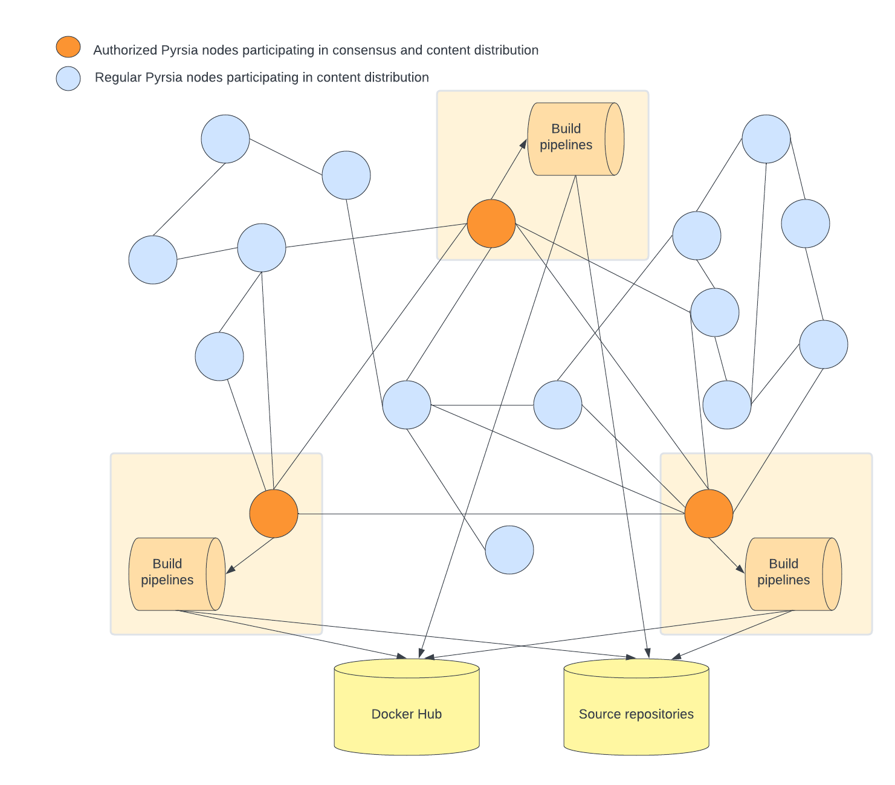

# Pyrsia architecture and use cases

## Concepts used in this document

- Pyrsia network: a peer-to-peer network of interconnected nodes exchanging software
  packages and transparency logs.
- Node: a process participating the Pyrsia network, either as an authorized node
  or a regular node.
- Authorized node: a Node authorized to participate in the consensus algorithm to
  verify transactions
- Regular node: a Node using the network to download and validate software packages
- Transaction: an operation in the transparency log. e.g. AddArtifact,
  AddAuthorizedNode, ...
- Consensus: consensus establihes the agreement between authorized nodes that a
  transaction is valid.
- Artifact: a single file that can be retrieved from the Pyrsia network. It does
  not necessarily coincide with package specific artifacts.
- Authorized node admin: the person who can administer an authorized node

## High level user stories

- As a user I can use Docker client to pull an official Docker image from the Pyrsia
  network.
- As a user I can use a Java build tool like Maven to download Maven artifacts from
  the Pyrsia network.
- As a user I can use the Pyrsia CLI to show the transparency log. (including search
  on author/dependencies/...)
- New authorized nodes can be added to the Pyrsia network.
- As an authorized node admin I can request the addition of an official Docker Hub
  image to the Pyrsia network.
- As a user I can request a build from source of a specific artifact, so it is added
  to the Pyrsia network.

## Pyrsia network overview

The Pyrsia network's first aim is to distribute software packages without central
authority. Instead, it relies on a set of designated authorized nodes that reach
consensus about the publication of software packages.

Those software packages originate from a source repository with build instructions.
All authorized nodes perform the necessary build steps and reach consensus if the
produced build is identical. For some ecosystems, like currently Docker, another
approach can exist: authorized nodes can reach consensus about the publication of
an official Docker image if they agree on an identical image downloaded from a trusted
source like Docker Hub.

The Pyrsia network also distributes transparency logs so every node in the network
can verify a downloaded artifact.

The following diagram shows three authorized nodes, each with their own build pipelines.
Three is the very minimum number of authorized nodes that need to exist. In the
real network, we expect tens or even hundreds of authorized nodes.

The next diagram show the same authorized nodes. But next to those, a number of
regular nodes have now joined the network as well. While regular nodes don't participate
in the consensus mechanism, they do participate in the distribution of artifacts
and transparency logs and they play a crucial role in the performance of the Pyrsia
network.

In order to participate in a distributed peer-to-peer network, nodes need to be
reachable by other nodes. This can be a challenge when a node is run behind a NAT
router. This is where another type of of node comes into play: NAT traversal nodes.
This last diagram shows the same network as before, but a couple of regular nodes
now aide other regular nodes with NAT traversal. (There are multiple ways of NAT
traversal. This diagram does not include that detail level.)

## Pyrsia node architecture

### Package type integration services

The package type integration services integrate a specific package type with Pyrsia.
There are two separate function in each integration service:
- First, it allows external tooling to communicate with Pyrsia. e.g. Docker Registry
  API or Maven Repository API
- Secondly, it contains the package type specific logic for publication in the Pyrsia
  network.
  - it knows how to build a package from source (e.g the Java integration) or validate
    a transaction in any other way (e.g. download from Docker Hub)
  - it knows how the semantics of a package type and maps this to Pyrsia artifacts

### Pyrsia CLI API

The Pyrsia CLI API is the entry point into the Pyrsia node for the Pyrsia
command line tool. It supports requesting status information about the local
artifact storage, information about the peers in the p2p network and
transparency log information.

### Artifact Service

The artifact service is the component that can abstractly (not package type specific)
store, retrieve and verify (using the transparency log component) Pyrsia artifacts.

When an artifact is requested by one of the package integrations, this component
will query the transparency log component. If the artifact exists in the Pyrsia
network, the transparency log will contain a reference to the required p2p file.
This component will then lookup this file in its local storage, or download it from
the p2p network.

When an artifact is published, this component uses the transparency log component
to log a new transaction, wait for consensus, and then provide the published artifact
in the p2p network.

### p2p

The p2p component heavily relies on libp2p and bundles everything that is
required to set up and maintain a p2p network between Pyrsia nodes, allowing
them to exchange files. (artifacts and logs)

### Transparency Log Service

This component is used by the Artifact Service to store and retrieve transparency
log information about an artifact.

It uses the Blockchain component to retrieve transactions and to reach consensus
on the publication of new transactions.

### Blockchain

This component offers an interface to store and retrieve immutable logs,
and distribute them across all peers.

## Technical stories and details

### As a Pyrsia node, I make sure the transparency log is up-to-date when I boot.

### As a Pyrsia node, I make sure the transparency log is kept up-to-date while running.

### As a user behind a NAT router, my node can participate in het Pyrsia network

### As a user I can use Docker client to pull an official Docker image from the Pyrsia network.

#### a Pyrsia node handles incoming requests from a Docker client

#### When an artifact is requested, the node verifies the existence in the Pyrsia network, and downloads it if necessary.

the Pyrsia node first does a lookup in the transparency log, then finds the corresponding file (either local or on the p2p network) and finally verifies the file hash matches the log hash

#### Any Pyrsia node that downloaded an artifact provides that artifact on the network for other nodes to download.

#### As a user I can configure my Pyrsia node to limit the network bandwidth usage or even disable downloads from other nodes.

### As a user I can use a Java build tool like Maven to download Maven artifacts from the Pyrsia network.

#### a Pyrsia node handles incoming requests from a maven client

#### All other substories are identical to the Docker case

### As a user I can use the Pyrsia CLI to show the transparency log.

including search on author/dependencies/...

### New authorized nodes can be added to the Pyrsia network.

#### As an authorized node admin I can add a candidate authorized node

#### The authorized node adds the 'AddNode transaction in the blockchain and waits for consensus

#### Authorized nodes consent to 'AddNode' transactions if the respective node was previously marked as authorized

### As an authorized node admin I can request the addition of an official Docker Hub image to the Pyrsia network.

#### The Pyrsia node accepts "Docker image add requests" and as a result downloads the Docker image and makes a Transaction request.

#### When a Transaction request is received all authorized nodes participate in the consensus mechanism

Other authorized nodes validate transactions by downloading the artifact from Docker Hub and checking the calculated hash with the hash in the transaction

#### When consensus is reached, the transaction is committed to the blockchain.

All nodes must receive new transactions. The authorized nodes store the artifact locally and provide it in the p2p network.

#### On any Pyrsia node, when a new transaction is received, it is added to the transparency log so it can be used in verification scenarios

### As a user I can request a build from source of a specific artifact, so it is added to the Pyrsia network

### As a Pyrsia node, I can download an artifact from multiple other nodes simultaneously.

### As a user I can measure the download via Pyrsia is faster than from a central repository. (TODO Benchmark)

### As a user I can use Docker Desktop to install Pyrsia (Docker Desktop Pyrsia)

