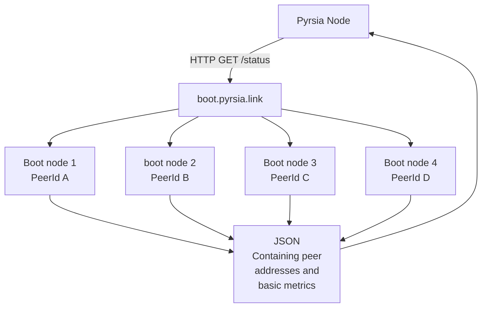

# Pyrsia AutoNAT Implementation (IETF STUN)

> **Warning:** This document is a work-in-progress.

## Abbreviations used in this document

- NAT: Network Address Translation. A mechanism for connecting and routing between private networks and the public internet.
- STUN: Session Traversal Utilities for NAT. An IETF standard for connecting applications over the public internet originating from private networks.
- IETF: Internet Engineering Task Force. One of the groups that standardizes protocols on the Internet.
- P2P: Peer-to-peer. A networking technology emphasizing decentralization and scalability.

## Dependencies

- [libp2p](https://crates.io/crates/libp2p) - The primary source of our p2p implementation.
- [libp2p-autonat](https://crates.io/crates/libp2p-autonat) - NAT and firewall detection.

## Hole punching

libp2p-autonat (combined with libp2p-identify) correspond to [STUN](https://datatracker.ietf.org/doc/html/rfc8489).
This is used to allow private networks to connect and participate in the pyrsia peer to peer network.

### Hole punching implementation notes

A review of [Hole punching in libp2p - Overcoming Firewalls by Max Inden](https://blog.ipfs.tech/2022-01-20-libp2p-hole-punching/) is recommended, as that spells out the technical details of the libp2p implementation. Also note that [libp2p may advertise non-routable networks to peers](https://github.com/libp2p/go-libp2p/issues/436). We have implemented our own bootstrapping strategy. That is described in detail below.

## Bootstrapping an initial peer from boot.pyrsia.link

We maintain a cluster of bootstrap servers behind the public url `http://boot.pyrsia.link` on that site, we return a round robin list of peer addresses through a JSON document. On startup, a pyrsia client performs a HTTP GET to `http://boot.pyrsia.link/status` and parses an array of peer multi addresses in the libp2p format. The client then begins an AutoNAT probe of the peer address.

### Bootstrapping implementation notes

The peers returned by the boot.pyrsia.link are currently implemented with a basic round robin algorithm. We are in the process of gathering peer metrics and may use those to inform this process in the future. Additional peers may be returned in the `peer_addr` array. Once an `AutonatEvent::InboundProbe` Request is received from the bootstrap node the client is fully connected to the Pyrsia p2p network.
