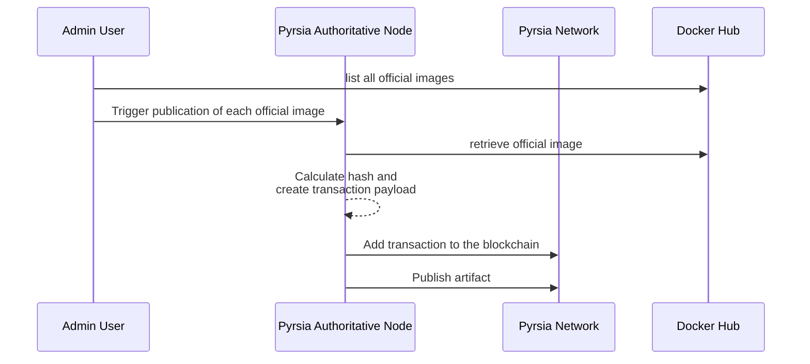
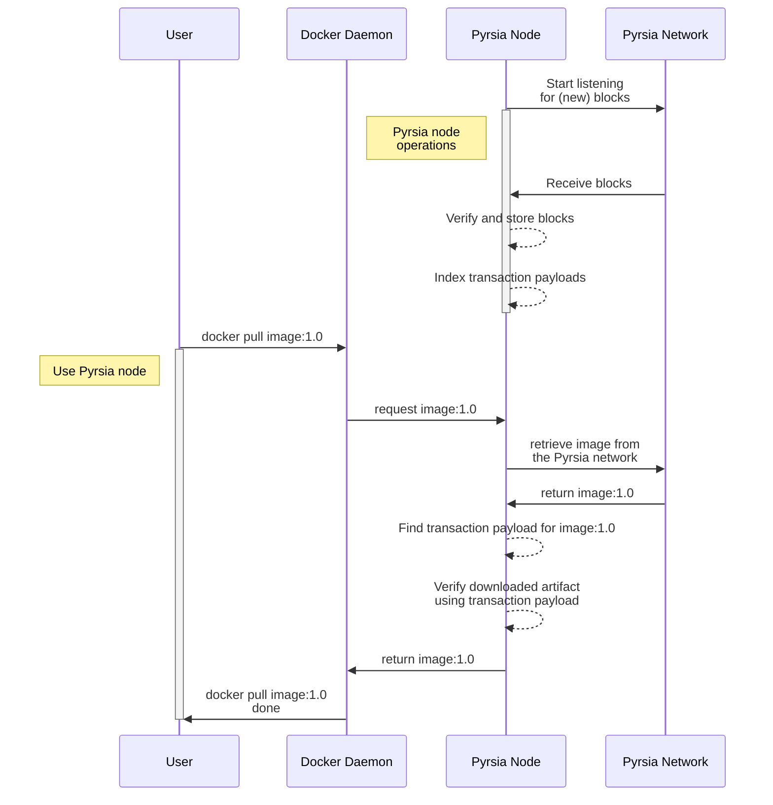

# High Level Overview for MVP

## Use Cases

Pyrsia aims to support these use cases in the MVP milestone:

1. An authoritative node publishes all official Docker images to a p2p network,
   in such a way that other nodes can retrieve and verify the authenticity of
   those images.
1. A Docker client can use a locally installed Pyrsia node to pull Docker
   images from the Pyrsia p2p network and verify the authenticity of those images.
1. A user can query the transparency log for any downloaded Docker image.

## Sequence Diagrams

### Docker Image Publication

### Docker Image Retrieval

## Component Architecture

> green boxes: already available in the Demo milestone \
> orange boxes: new in the MVP milestone

### Flow

1. Docker client uses Pyrsia node to pull a Docker image
1. Using the Pyrsia CLI a user can query status information and transparency
   log information
1. Artifact service uses local storage as a first step to find requested images
1. Artifact service uses the Pyrsia p2p network if the image is not found locally
1. Artifact service uses the transparency log service to (a) add an artifact and
   (b) verify an artifact
1. Pyrsia CLI uses Transparency log to find requested information / get logs
   for an artifact
1. Transparency log uses Blockchain to (a) add blocks and (b) listen for (new)
   blocks
1. Blockchain component uses the p2p network to publish blocks
1. Blockchain component uses the p2p network to listen for new blocks
1. Transparency log indexes the transaction payloads by 'artifact id'
1. Blockchain uses Block storage to store and retrieve blocks

### Artifact Service

This is the component that allows other clients, like a Docker client to
communicate with Pyrsia to publish and retrieve artifacts. It currently only
supports Docker images as artifacts.

This component implements the Docker Registry API to allow a Docker client to
request images. It uses local artifact storage as well as the p2p component to
retrieve requested artifacts and the transparency log component to add and
verify artifacts.

Interface: Docker Registry API (HTTP) \
Pyrsia Dependencies: p2p, Transparency log

### Pyrsia CLI API

The Pyrsia CLI API is the entry point into the Pyrsia node for the Pyrsia
command line tool. It supports requesting status information about the local
artifact storage, information about the peers in the p2p network and
transparency log information.

Interface: HTTP API used by the CLI tool \
Pyrsia Dependencies: Artifact service, Transparency Log

### p2p

The p2p component heavily relies on libp2p and bundles everything that is
required to set up and maintain a p2p network between Pyrsia nodes, allowing
them to exchange files. (blocks and artifacts)

Interface: Rust functions to interact with the lower-level libp2p APIs \
Pyrsia Dependencies: no other Pyrsia components

### Transparency Log

This component adds a logical layer on top of the blockchain component to
allow for easy:

- transparent logging of artifact publication
- verification of a downloaded artifact
- inspection of the transparency logs

Interface: add_artifact(artifact_id, artifact_hash),
verify_artifact(artifact_id, artifact_hash), get_logs(artifact_id) \
Pyrsia Dependencies: Blockchain

### Blockchain

This component offers an interface to store and retrieve immutable logs,
distributed across all peers.

Interface: add_transaction(payload, callback_listener),
add_block_listener(listener) \
Pyrsia Dependencies: p2p

