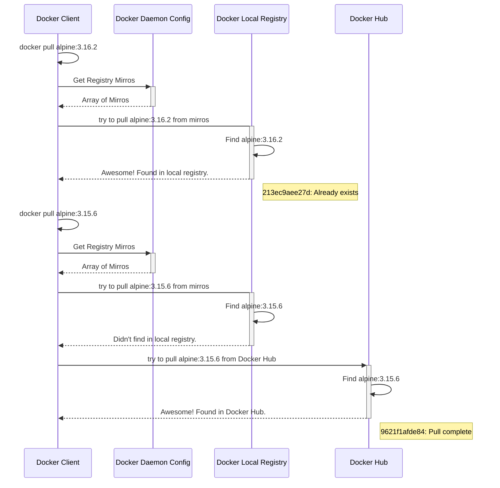

# Docker Image Downloaded from Pyrsia Decentralized Network - Verification

Here we will demonstrate how you will confirm that docker images are getting downloaded from Pyrsia network Docker registry provided you configure your Docker daemon config and image available to Pyrsia network.

## Remove all local images

Script removes all docker images from local

```shell
for imgid in $(docker images -q); do
    echo "removing Image ID: $imgid"
    docker rmi -f $imgid
done
```

## Setup Local Docker Registry

Run following command to have a local docker registry.

```shell
docker run -d \
 -p 5000:5000 \
 --restart=always \
 --name registry \
 registry:2
```

## Pull image from Docker Hub

```shell
docker pull alpine:3.16.2
```

Docker pull log looks like below. Last line of the log states `docker.io/library/alpine:3.16.2` which is very important. It shows from where the artifact got downloaded.

```shell
3.16.2: Pulling from library/alpine
Digest: sha256:bc41182d7ef5ffc53a40b044e725193bc10142a1243f395ee852a8d9730fc2ad
Status: Image is up to date for alpine:3.16.2
docker.io/library/alpine:3.16.2
```

## Tag downloaded image to upload to local registry

Create a mapping from hostname `docker.localhost` to IP `127.0.0.1` in `/etc/hosts` file.

```shell
# Added manually for Docker Desktop
127.0.0.1 docker.localhost
```

Tag the image as `docker.localhost:5000/alpine:3.16.2`. This creates an additional tag for the existing image. When the first part of the tag is a hostname and port, Docker interprets this as the location of a registry, when pushing.

```shell
docker tag alpine:3.16.2 docker.localhost:5000/alpine:3.16.2
```

Now list all the images `docker images` and in the list includes following entries

```shell
REPOSITORY                           TAG       IMAGE ID       CREATED         SIZE
registry                             2         dcb3d42c1744   2 weeks ago     24.1MB
alpine                               3.16.2    9c6f07244728   2 months ago    5.54MB
localhost:5000/alpine                3.16.2    9c6f07244728   2 months ago    5.54MB
docker.localhost:5000/alpine         3.16.2    9c6f07244728   2 months ago    5.54MB
docker/desktop-vpnkit-controller     v2.0      8c2c38aa676e   17 months ago   21MB
docker/desktop-storage-provisioner   v2.0      99f89471f470   18 months ago   41.9MB
```

## Push image to local registry

Push to local registry using `docker push docker.localhost:5000/alpine:3.16.2`
Logs shows something like following

```shell
The push refers to repository [docker.localhost:5000/alpine]
994393dc58e7: Pushed
3.16.2: digest: sha256:1304f174557314a7ed9eddb4eab12fed12cb0cd9809e4c28f29af86979a3c870 size: 528
```

Now check file system of local registry by logging into running docker container and list the location

```shell
# ls -ltr /var/lib/registry/docker/registry/v2/repositories/
total 4
drwxr-xr-x    5 root     root          4096 Oct 25 06:51 alpine
```

## Remove image from local cache

Remove the locally-cached alpine:3.16.2 and docker.localhost:5000/alpine:3.16.2 images, so that you can test pulling the image from your registry. This does not remove the docker.localhost:5000/alpine:3.16.2 image from your registry.

```shell
docker rmi -f alpine:3.16.2
docker rmi -f docker.localhost:5000/alpine:3.16.2
docker rmi -f localhost:5000/alpine:3.16.2
```

## Let's Start Using Local Registry

### Pull from Local Registry

Pull image from local registry

```shell
docker pull docker.localhost:5000/alpine:3.16.2
```

Logs look like following and important things to notice is the last line. It clearly states from where the image has been pulled.

```shell
3.16.2: Pulling from alpine
213ec9aee27d: Already exists
Digest: sha256:1304f174557314a7ed9eddb4eab12fed12cb0cd9809e4c28f29af86979a3c870
Status: Downloaded newer image for docker.localhost:5000/alpine:3.16.2
docker.localhost:5000/alpine:3.16.2
```

### API verification from Local Registry

Verify v2 version support `curl -i -X GET http://docker.localhost:5000/v2/`.

Pulling an Image Manifest `curl -i -X GET http://docker.localhost:5000/v2/alpine/manifests/3.16.2`

### Change the mirror registry to use Local Registry

Add following `key:value` pair to Docker daemon configuration file.

- `"insecure-registries": ["http://docker.localhost:5000"]`
- `"registry-mirrors": ["http://docker.localhost:5000"]`

### Test Docker Pull without specifying registry host:port explicitly

Remove all the images from cache. Follow [Remove image from local cache](#remove-image-from-local-cache)

| Pull an image available in local registry      | Pull an image not available in local registry  |
| ---------------------------------------------- | ---------------------------------------------- |
| `docker pull alpine:3.16.2`                    | `docker pull alpine:3.15.6`                    |
| **Logs** <br />3.16.2: Pulling from library/alpine<br />213ec9aee27d: **_Already exists_**<br />Digest: sha256:bc41182d7ef5ffc53a40b044e725193bc10142a1243f395ee852a8d9730fc2ad<br />Status: Downloaded newer image for alpine:3.16.2<br />docker.io/library/alpine:3.16.2 | **Logs** <br />3.15.6: Pulling from library/alpine<br />9621f1afde84: **_Pull complete_**<br />Digest: sha256:69463fdff1f025c908939e86d4714b4d5518776954ca627cbeff4c74bcea5b22<br />Status: Downloaded newer image for alpine:3.15.6<br />docker.io/library/alpine:3.15.6 |
| When it already in local registry, in the log it shows **_Already exists_** | While it is not in local registry, it shows **_Pull complete_** |

Therefore, in `docker pull <image>` log says `Already exists`, it means that it is getting pulled from one of the mirror. Configuring mirrors doesn't ensure that you are always pulling from internal mirror. Docker checks at the mirror first and then falls back to DockerHub registry.



## Set Pyrsia Decentralize Network as Docker Registry Mirror

Set Pyrsia Decentralize Network as Docker Registry Mirror in the same way we did it local Docker Registry

### Get Pyrsia Node cofig

Use `pyrsia config --show` to get your node config details. Assume your node details are like below.

```shell
Config file path: /some/path/default-config.toml
host = '0.0.0.0'
port = '7888'
disk_allocated = '10 GB'
```

### Change Docker daemon config

Create a following `key:value` pair for Docker daemon config and append to the existing config

- `"insecure-registries": ["http://0.0.0.0:7888"]`
- `"registry-mirrors": ["http://0.0.0.0:7888"]`

Apply the config & restart Docker daemon process. **Wait for Docker to daemon to restart cleanly**.

### Pull Image from Pyrsia

Try to get inspect log from Pyrsia using `pyrsia inspect-log docker --image alpine:3.16.2`. If you find the entries in inpect log
it means the image is available in Pyrsia. Now remove all the images from local cache. Follow [Remove image from local cache](#remove-image-from-local-cache).

Try to pull the image `docker pull alpine:3.16.2`. You should able to see something like

```shell
3.16.2: Pulling from library/alpine
213ec9aee27d: Already exists
Digest: sha256:bc41182d7ef5ffc53a40b044e725193bc10142a1243f395ee852a8d9730fc2ad
Status: Downloaded newer image for alpine:3.16.2
docker.io/library/alpine:3.16.2
```

In the log we can see **Already exists** text and this indicates that docker client found it in the mirrors (i.e. Pyrsia network) and pulled it from Pyrsia docker registry.
