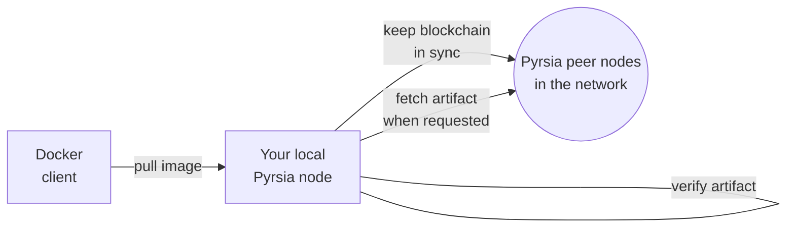
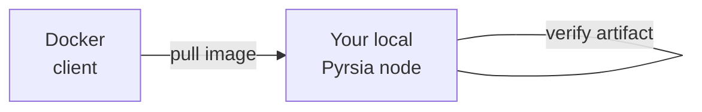
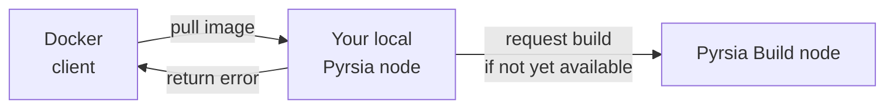

# Configure Docker to use Pyrsia

Once you've completed the [installation](/docs/tutorials/quick-installation.mdx),
it's time to configure your build tools to make use of Pyrsia.

In this tutorial we will show how you can easily modify your Docker setup to use
Pyrsia to download official Docker images.

## Installation

First, make sure to complete the steps in the [installation tutorial](/docs/tutorials/quick-installation.mdx).

## Configure Docker

Next, configure your Docker installation to use Pyrsia as a registry mirror.

On Windows or macOS, open your Docker Desktop -> Settings ->
Docker Engine where Docker allows you to set registry-mirrors. Configure your node
as a registry mirror by adding/editing the following in the configuration:

```jsonc
 "registry-mirrors": [
   "http://0.0.0.0:7888"
 ]
```

On Linux, you'll find this configuration in the file `/etc/docker/daemon.json`.
If you've run the apt installation, this step was already automatically
performed for you.

> **Why 0.0.0.0?** \
> In general you would specify `localhost:7888` as the registry mirror but on MacOS
> and Windows this won't work because Docker Engine is running in a VM, which is
> not the same as the local host your Pyrsia is running on. Using `0.0.0.0` works
> around this issue. In case you're having issues, try specifying your host IP address
> as the registry-mirror and bind your local Pyrsia node to that IP (using `-H`
> with an explicit IP address or using `-H 0.0.0.0`)

You will need to restart Docker Desktop. Once restarted you should be able to
pull Docker images through Pyrsia.

## Pull a docker image

We'll use `alpine:3.16.2` as an example. Your Docker installation is now configured
to use your local Pyrsia node to retrieve artifacts. When you start Pyrsia, it will
make sure it has the most recent copy of the blockchain, which contains all the
publication logs, also known as transparency logs.

When your Docker client pulls an image, it will make the request to your local
Pyrsia node (because you configured it as a registry mirror) and it will fetch
the artifact from a peer node in the Pyrsia network, verify it based on the
transparency logs and return it to the Docker client.



Let's try this, but first make sure Alpine is not yet in your local Docker cache:

```sh
docker rmi alpine:3.16.2
```

Then pull the image:

```sh
docker pull alpine:3.16.2
```

Congratulations! The alpine Docker image was now retrieved from the Pyrsia network.
You can verify this in the Pyrsia logs. On Linux you will find the logs in `/var/log/syslog`.
On Windows you can see the logs in the command prompt you used to run the Pyrsia node.

You will see something like this:

```text
DEBUG pyrsia::docker::v2::handlers::manifests > Fetching manifest for library/alpine:3.16.0
INFO  pyrsia::artifact_service::storage       > An artifact is being pulled from the artifact manager b0ed9f25-f322-47ef-8dac-03154209cfcf
```

> Note: On macOS or Windows, you can also see the Pyrsia logs, but it depends on
> your specific installation where to find them. (See [Installation tutorial](/docs/tutorials/quick-installation.mdx))

## Local cache

If you would repeat these steps, your local Pyrsia node will already have a copy
of the requested artifact, so it won't be retrieved again:



This local cache is also used by your Pyrsia node to participate in the artifact
distribution to other nodes.

> **TODO**: document how a user can configure the Pyrsia node to limit the bandwidth
> used or to disable its participation in content distribution altogether.

## Inspect the Pyrsia transparency log

Now, let's take a look at the transparency logs. Transperency logs are a record of all publically trusted digital certificates.

If you ran through all the steps of the [installation tutorial](/docs/tutorials/quick-installation.mdx), the Pyrsia CLI tool will be available.

You can use this CLI tool to configure your local Pyrsia node, but also to inspect
the transparency logs for a given artifact.

If you have started your Pyrsia node with default settings, you can skip this step.
Otherwise configure the CLI tool with your required settings:

```sh
 pyrsia config -e
 ```

And enter the correct values or accept the default:

```text
Enter host: [localhost]

Enter port: [7888]

Enter disk space to be allocated to pyrsia(Please enter with units ex: 10 GB): [10 GB]

Node configuration Saved !!
```

Next, let's take the `alpine:3.16.2` example again:

```sh
pyrsia inspect-log docker --image alpine:3.16.2
```

This CLI command returns the transparency logs for all the Pyrsia artifacts that
make up the Docker image `alpine:3.16.2`:

```text
[
  {
    "id": "cc3dec20-8604-4d0a-8c18-ccb746769696",
    "package_type": "Docker",
    "package_specific_id": "alpine:3.16.2",
    "num_artifacts": 4,
    "package_specific_artifact_id": "alpine:3.16.2",
    "artifact_hash": "1304f174557314a7ed9eddb4eab12fed12cb0cd9809e4c28f29af86979a3c870",
    "source_hash": "",
    "artifact_id": "75c7bd83-1dd4-4666-a35f-e8c59b695e21",
    "source_id": "7ec06216-b2dc-4e5a-a90d-7875fb77b846",
    "timestamp": 1660906467,
    "operation": "AddArtifact",
    "node_id": "64765410-136b-4332-a837-226bd062ba37",
    "node_public_key": "558b0373-a29d-40c9-8125-019fb74dda31"
  },
  {
    "id": "d88982b1-261b-4e3d-9eb2-dd549c40ac05",
    "package_type": "Docker",
    "package_specific_id": "alpine:3.16.2",
    "num_artifacts": 4,
    "package_specific_artifact_id": "alpine@sha256:1304f174557314a7ed9eddb4eab12fed12cb0cd9809e4c28f29af86979a3c870",
    "artifact_hash": "1304f174557314a7ed9eddb4eab12fed12cb0cd9809e4c28f29af86979a3c870",
    "source_hash": "",
    "artifact_id": "f2648155-b665-4567-9e3c-27af7cc3b9bb",
    "source_id": "0ca693f9-7c50-4448-9cd6-0d7a145fba14",
    "timestamp": 1660906529,
    "operation": "AddArtifact",
    "node_id": "60b7d9ae-d5ba-4440-ab83-6c5638a18a45",
    "node_public_key": "4a873a2a-0e04-4540-b1bd-bccc0d721ed2"
  },
  {
    "id": "f53f9cc6-6998-470a-8094-cae3fbc82412",
    "package_type": "Docker",
    "package_specific_id": "alpine:3.16.2",
    "num_artifacts": 4,
    "package_specific_artifact_id": "alpine@sha256:213ec9aee27d8be045c6a92b7eac22c9a64b44558193775a1a7f626352392b49",
    "artifact_hash": "213ec9aee27d8be045c6a92b7eac22c9a64b44558193775a1a7f626352392b49",
    "source_hash": "",
    "artifact_id": "dac2e42c-fd48-4487-b48c-34f5eac1f674",
    "source_id": "eed938e9-9cf8-4e1b-995f-6a6d1da6ef26",
    "timestamp": 1660906589,
    "operation": "AddArtifact",
    "node_id": "1e3244e3-1fc5-429b-8cc6-43dbbebaccb2",
    "node_public_key": "7d7d96c0-1b8b-4028-bb20-df9a45eeaa7f"
  },
  {
    "id": "cae2f5a7-22ec-4d22-86af-59e1f0239056",
    "package_type": "Docker",
    "package_specific_id": "alpine:3.16.2",
    "num_artifacts": 4,
    "package_specific_artifact_id": "alpine@sha256:9c6f0724472873bb50a2ae67a9e7adcb57673a183cea8b06eb778dca859181b5",
    "artifact_hash": "9c6f0724472873bb50a2ae67a9e7adcb57673a183cea8b06eb778dca859181b5",
    "source_hash": "",
    "artifact_id": "3fc0ac72-8f5e-41fe-8ab6-94c565ebc52c",
    "source_id": "4cb49c33-af4c-4c3a-8053-b771007a6720",
    "timestamp": 1660906649,
    "operation": "AddArtifact",
    "node_id": "64d30c8e-d356-420c-ab87-e27687ca6f1d",
    "node_public_key": "57130e5d-d0dc-450b-b80d-966cb71210ef"
  }
]
```

## Requesting a build

While it's Pyrsia intention to build and publish all official Docker images, there
is a possibility that a Docker image is not yet built/available.

When you pull an image that is unknown, your local Pyrsia node will send a build
request to one of the authorized build nodes, which schedules a build for the given
Docker image.



Your Docker client will receive an error from Pyrsia at that point (your local
Docker client might fall back to Docker Hub), but when the build is finished
and the other build nodes inside the Pyrsia network reached consensus, your node
will receive updated transparency logs via the blockchain and you will be able to
pull the image from the Pyrsia network.

To find out if an image is available, use the `inspect-log` described above.

Alternatively, you can also explicitly request the build of a new Docker image:

```sh
pyrsia build docker --image alpine:3.16.3
```

This will send the build request to one of the authorized build nodes, which will
start a build. When consensus about that build is reached, it will be available
in the transparency logs and can be retrieved by all nodes in the network.

## Use API

Pyrsia supports a subset of the [Docker Registry API](https://docs.docker.com/registry/spec/api/). A more detailed API document specific to Pyrsia, will be coming soon.

```shell
$ curl -sS http://localhost:7888/v2/library/alpine/manifests/3.16.2
{
   "schemaVersion": 2,
   "mediaType": "application/vnd.docker.distribution.manifest.v2+json",
   "config": {
      "mediaType": "application/vnd.docker.container.image.v1+json",
      "size": 1470,
      "digest": "sha256:9c6f0724472873bb50a2ae67a9e7adcb57673a183cea8b06eb778dca859181b5"
   },
   "layers": [
      {
         "mediaType": "application/vnd.docker.image.rootfs.diff.tar.gzip",
         "size": 2806054,
         "digest": "sha256:213ec9aee27d8be045c6a92b7eac22c9a64b44558193775a1a7f626352392b49"
      }
   ]
}%
```
