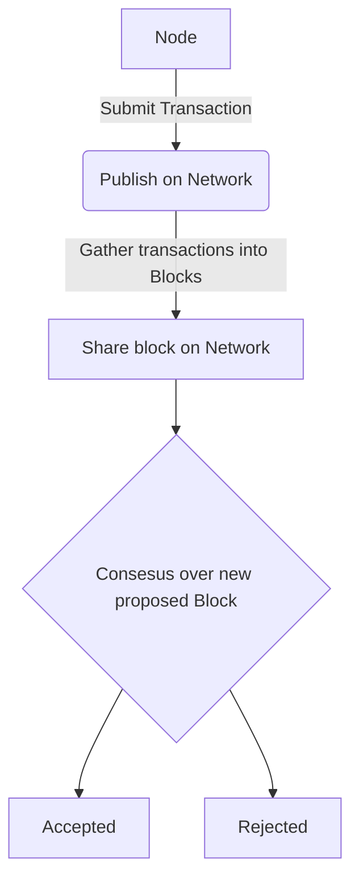

# Pyrsia Blockchain Network Crate

This crate provides the "input" and "output" trait for interacting with the network to perform consensus over blocks.

### Simplified Workflow

In the diagram below "Node" is the application build on top of this crate, it will in put "transactions" and it should obtain a status indicating
if the block has been finalized on the chain or not.



## Philosophy

For the user of this crate, they should be able to:

- Recording new "transaction" accepting
  1. Generic payload (any struct that implements our trait)
  2. Few concrete types for the core funcationality of the blockchain (e.g consensus)
- Returning finalized blocks

## Requirements

- Track Authorities, may come and go, with no external dependencies
  - Only a select few participants may submit transactions or publish blocks
- Immutable record of transactions

## Objectives

This crate will be responsible for:

- Definining the network communication (`Trait` requiremnents most likely)
- Performing network communitcation to achieve consensus
- Consensus 
  - Proof of Authority (Basis for "MVP" target - restricted list of select partners)

This crate will **not** provide

- Permanent storage of the data (see example for how to save to Disk) #422
- Searching or index the blockchain
  - This will likely be package specific
  - The user will be able to maintain all the history of a single package how ever it sees fit to do so

## Getting started

This can be built from the project root since it's apart of the workspace.

```
cargo build --workspace
cargo test --workspace
```

### Running the example Node

```
cargo build --example simple_node
```
